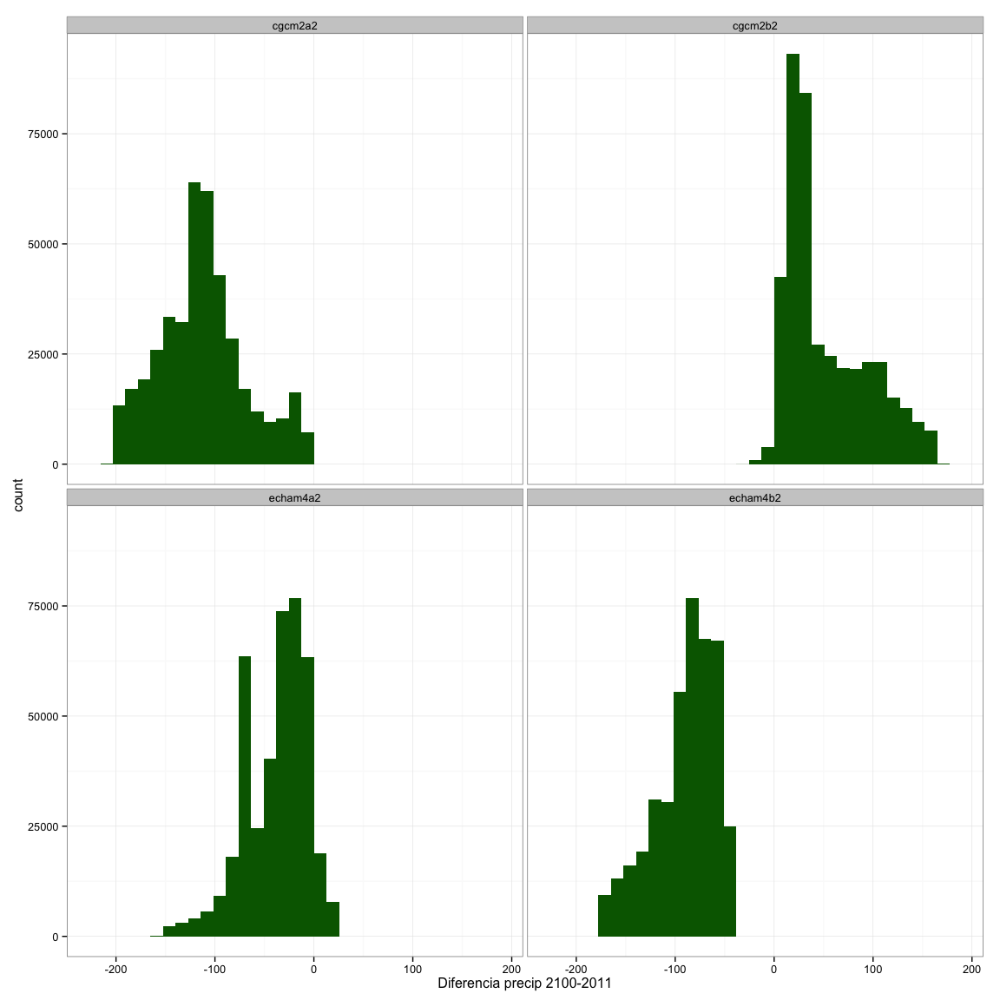
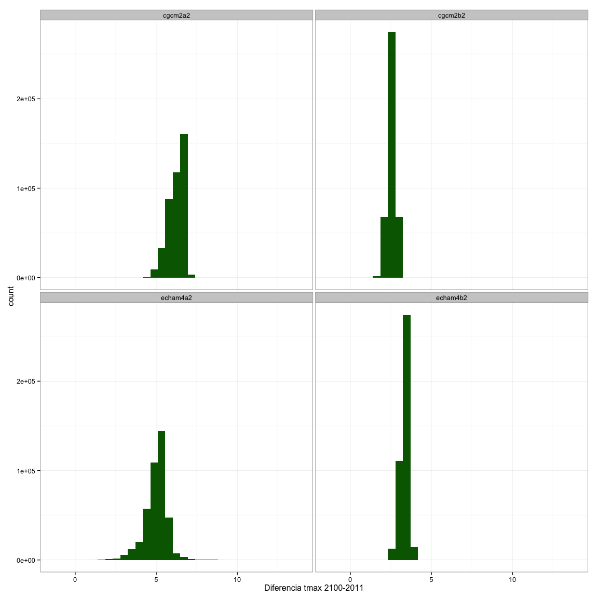
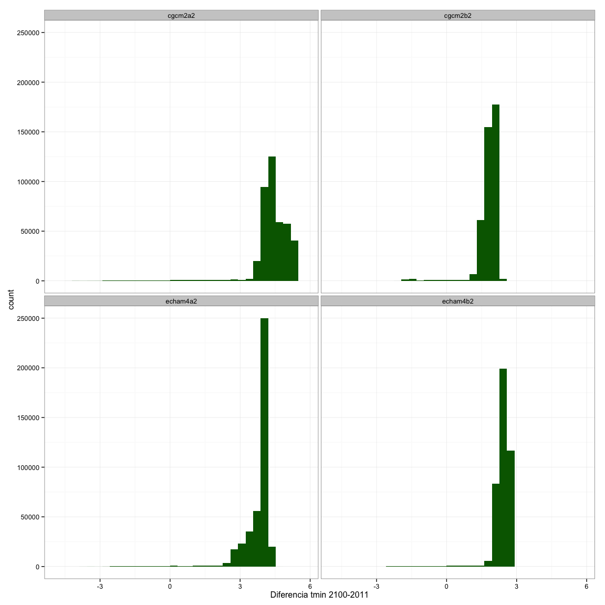

Análisis de datos de clima simulado. Comparar valores entre 2100 y 2011
=======================================================================

``` r
# Title: Simulaciones_Futuro.R
# Script to analyze the Sierra Nevada climate data 
# version: 1.0 
# date: Nov 2014
# Authors: Perez-Luque, AJ @ajpelu <ajperez@ugr.es>
#          Perez-Perez R @rperezperez 
#          Bonet, FJ @fjbonet 
# -----------------------------------------------------------
```

Cargamos librerias

``` r
# -----------------------------------------------------------
# Load packages
library('plyr')
library('reshape')
library('ggplot2')
library('devtools')
source_url('https://raw.githubusercontent.com/ajpelu/ajpeluR/master/R/summarySE.R') # Summary function
# -----------------------------------------------------------
```

Preparamos datos. Cargamos los datos de las simulaciones para los años 2011 y 2100

``` r
# -----------------------------------------------------------
# Prepare data
## Simulated data 
# set directory 
di <- '/Users/ajpelu/Dropbox/MS/DOSSIER2013_FICHAS/CLIMA/clima_dossier'

# Read data of simulation for tmin, tmax and precip for all SN
sim <- read.csv(file=paste(di,'/data/sim_2011_2100.csv', sep=''), head=TRUE, sep=";", dec=".")
sim <- sim[,-3]
# -----------------------------------------------------------
```

Precipitación
-------------

``` r
# -----------------------------------------------------------
## Precipitation analysis 
precip <- sim[sim$codigo == 'precip',]

for (i in c('echam4a2','echam4b2', 'cgcm2a2', 'cgcm2b2')) {
  df <- subset(precip, escenario_clima==paste(i))
  aux <- cast(df, cli_celda_id ~ ano, value='valor')
  aux <- as.data.frame(aux)
  names(aux) <- c('cli_celda_id', 'y2011', 'y2100') 
  aux$dif <- (aux$y2100 - aux$y2011)
  aux$escenario_clima <- rep(i, nrow(aux))
  assign(paste0("precip", i), aux)} 
  
dif.precip <- rbind(precipcgcm2a2,precipcgcm2b2, precipecham4a2, precipecham4b2)  

ggplot(dif.precip, aes(x=dif)) + 
  geom_histogram(fill='darkgreen') + 
  facet_wrap(~escenario_clima) + theme_bw() + 
  xlab('Diferencia precip 2100-2011')
```

    ## stat_bin: binwidth defaulted to range/30. Use 'binwidth = x' to adjust this.
    ## stat_bin: binwidth defaulted to range/30. Use 'binwidth = x' to adjust this.
    ## stat_bin: binwidth defaulted to range/30. Use 'binwidth = x' to adjust this.
    ## stat_bin: binwidth defaulted to range/30. Use 'binwidth = x' to adjust this.



``` r
dif.precip.summary <- summarySE(dif.precip, measurevar = 'dif', groupvars='escenario_clima')
dif.precip.summary$variable <- rep('precip', nrow(dif.precip.summary))
dif.precip.summary
```

    ##   escenario_clima      N     dif    sd      se      ci variable
    ## 1         cgcm2a2 411600 -112.60 44.14 0.06880 0.13484   precip
    ## 2         cgcm2b2 411600   52.32 41.56 0.06478 0.12696   precip
    ## 3        echam4a2 411600  -38.32 31.42 0.04897 0.09599   precip
    ## 4        echam4b2 411600  -89.91 31.31 0.04880 0.09564   precip

``` r
# -----------------------------------------------------------
```

Tmax
----

``` r
# -----------------------------------------------------------
## Tmax analysis 
tmax <- sim[sim$codigo == 'tmax',]
tmax$valor <- (tmax$valor)/10

for (i in c('echam4a2','echam4b2', 'cgcm2a2', 'cgcm2b2')) {
  df <- subset(tmax, escenario_clima==paste(i))
  aux <- cast(df, cli_celda_id ~ ano, value='valor')
  aux <- as.data.frame(aux)
  names(aux) <- c('cli_celda_id', 'y2011', 'y2100') 
  aux$dif <- (aux$y2100 - aux$y2011)
  aux$escenario_clima <- rep(i, nrow(aux))
  assign(paste0("tmax", i), aux)} 

dif.tmax <- rbind(tmaxcgcm2a2,tmaxcgcm2b2, tmaxecham4a2, tmaxecham4b2) 

ggplot(dif.tmax, aes(x=dif)) + 
  geom_histogram(fill='darkgreen') + 
  facet_wrap(~escenario_clima) + theme_bw() + 
  xlab('Diferencia tmax 2100-2011')
```

    ## stat_bin: binwidth defaulted to range/30. Use 'binwidth = x' to adjust this.
    ## stat_bin: binwidth defaulted to range/30. Use 'binwidth = x' to adjust this.
    ## stat_bin: binwidth defaulted to range/30. Use 'binwidth = x' to adjust this.
    ## stat_bin: binwidth defaulted to range/30. Use 'binwidth = x' to adjust this.



``` r
dif.tmax.summary <- summarySE(dif.tmax, measurevar = 'dif', groupvars='escenario_clima')
dif.tmax.summary$variable <- rep('tmax', nrow(dif.tmax.summary))
dif.tmax.summary
```

    ##   escenario_clima      N   dif     sd        se        ci variable
    ## 1         cgcm2a2 411600 6.218 0.4723 0.0007362 0.0014429     tmax
    ## 2         cgcm2b2 411600 2.561 0.2151 0.0003353 0.0006572     tmax
    ## 3        echam4a2 411600 4.981 0.6769 0.0010550 0.0020678     tmax
    ## 4        echam4b2 411600 3.359 0.2714 0.0004230 0.0008291     tmax

``` r
# -----------------------------------------------------------
```

Tmin
----

``` r
# -----------------------------------------------------------
## tmin analysis 
tmin <- sim[sim$codigo == 'tmin',]
tmin$valor <- (tmin$valor)/10

for (i in c('echam4a2','echam4b2', 'cgcm2a2', 'cgcm2b2')) {
  df <- subset(tmin, escenario_clima==paste(i))
  aux <- cast(df, cli_celda_id ~ ano, value='valor')
  aux <- as.data.frame(aux)
  names(aux) <- c('cli_celda_id', 'y2011', 'y2100') 
  aux$dif <- (aux$y2100 - aux$y2011)
  aux$escenario_clima <- rep(i, nrow(aux))
  assign(paste0("tmin", i), aux)} 

dif.tmin <- rbind(tmincgcm2a2,tmincgcm2b2, tminecham4a2, tminecham4b2) 

ggplot(dif.tmin, aes(x=dif)) + 
  geom_histogram(fill='darkgreen') + 
  facet_wrap(~escenario_clima) + theme_bw() + 
  xlab('Diferencia tmin 2100-2011')
```

    ## stat_bin: binwidth defaulted to range/30. Use 'binwidth = x' to adjust this.
    ## stat_bin: binwidth defaulted to range/30. Use 'binwidth = x' to adjust this.
    ## stat_bin: binwidth defaulted to range/30. Use 'binwidth = x' to adjust this.
    ## stat_bin: binwidth defaulted to range/30. Use 'binwidth = x' to adjust this.



``` r
dif.tmin.summary <- summarySE(dif.tmin, measurevar = 'dif', groupvars='escenario_clima')
dif.tmin.summary$variable <- rep('tmin', nrow(dif.tmin.summary))
dif.tmin.summary
```

    ##   escenario_clima      N   dif     sd        se       ci variable
    ## 1         cgcm2a2 411600 4.384 0.8267 0.0012885 0.002525     tmin
    ## 2         cgcm2b2 411600 1.813 0.4596 0.0007164 0.001404     tmin
    ## 3        echam4a2 411600 3.791 0.6067 0.0009457 0.001854     tmin
    ## 4        echam4b2 411600 2.373 0.3884 0.0006054 0.001187     tmin

``` r
# -----------------------------------------------------------
```

Resumen diferencias simulaciones presente-futuro
------------------------------------------------

``` r
# -----------------------------------------------------------
# Join the summary
dif.summary <- rbind(dif.precip.summary, dif.tmax.summary, dif.tmin.summary)
dif.summary
```

    ##    escenario_clima      N      dif      sd        se        ci variable
    ## 1          cgcm2a2 411600 -112.601 44.1374 0.0687969 0.1348398   precip
    ## 2          cgcm2b2 411600   52.316 41.5578 0.0647761 0.1269592   precip
    ## 3         echam4a2 411600  -38.320 31.4201 0.0489744 0.0959884   precip
    ## 4         echam4b2 411600  -89.908 31.3056 0.0487959 0.0956386   precip
    ## 5          cgcm2a2 411600    6.218  0.4723 0.0007362 0.0014429     tmax
    ## 6          cgcm2b2 411600    2.561  0.2151 0.0003353 0.0006572     tmax
    ## 7         echam4a2 411600    4.981  0.6769 0.0010550 0.0020678     tmax
    ## 8         echam4b2 411600    3.359  0.2714 0.0004230 0.0008291     tmax
    ## 9          cgcm2a2 411600    4.384  0.8267 0.0012885 0.0025254     tmin
    ## 10         cgcm2b2 411600    1.813  0.4596 0.0007164 0.0014042     tmin
    ## 11        echam4a2 411600    3.791  0.6067 0.0009457 0.0018536     tmin
    ## 12        echam4b2 411600    2.373  0.3884 0.0006054 0.0011866     tmin

``` r
# -----------------------------------------------------------
```
