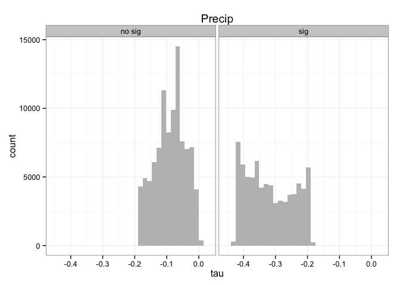
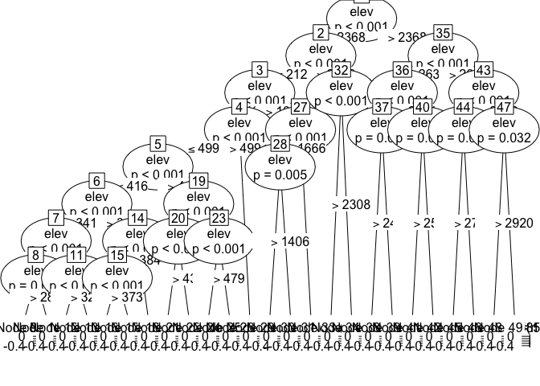
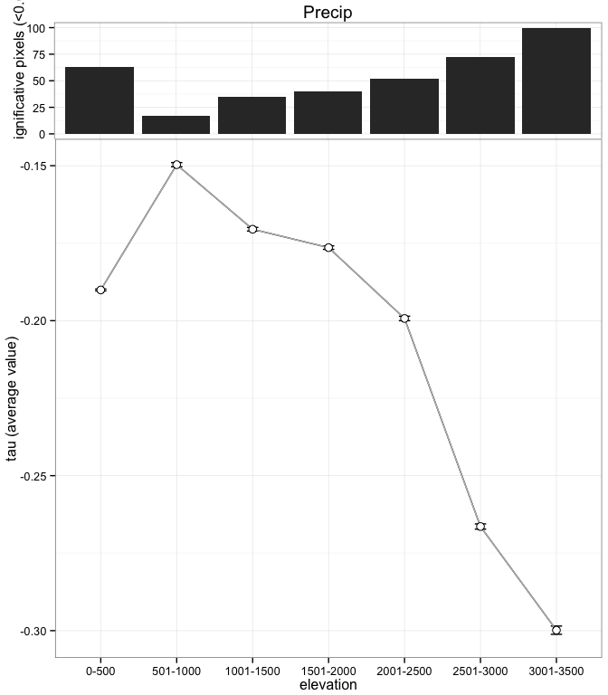

Analisis del clima pasado y futuro para el dossier. Preparacion de los datos
============================================================================

``` r
# -----------------------------------------------------------
# Title: climateDataDossier.R  
# Script to analyze the Sierra Nevada climate data 
# version: 1.0 
# date: Nov 2014
# Authors: Perez-Luque, AJ @ajpelu <ajperez@ugr.es>
#          Perez-Perez R @rperezperez 
#          Bonet, FJ @fjbonet 
# -----------------------------------------------------------
```

Cargamos librerias

``` r
# -----------------------------------------------------------
# Load packages
library('ggplot2') # To plot maps
library('plyr')
library('dplyr')
library('devtools')
library('gdata')
library('gplots')
library('gridExtra')
library('party') #cart 
source_url('https://raw.githubusercontent.com/ajpelu/ajpeluR/master/R/summarySE.R') # Summary function
source_url('https://raw.githubusercontent.com/ajpelu/ajpeluR/master/R/exportggplot.R') # Export function  
# -----------------------------------------------------------
```

Preparamos datos
----------------

Vamos a cargar los archivos de datos del pasado para las tres variables: `precip`, `tmax` y `tmin`. Para cada pixel y por cada variable tenemos varios atributos:

-   **Estadístico \(\tau\)** (Mann-Kendall Trend Analysis). Su valor varía entre `-1` y `1`
-   ***p-value***
-   elevación
-   pertenencia a espacio natural

En este análisis nos centramos solamente en los pixeles que pertenecen a Sierra Nevada

``` r
# -----------------------------------------------------------
# Prepare Data 
# Set directory 
di <- '/Users/ajpelu/Dropbox/MS/DOSSIER2013_FICHAS/CLIMA/clima_dossier'
setwd(di)

# Read data of climate variables, elevation and natural park. 
past_precip <- read.csv(file=paste(di,'/data/past_precip.csv', sep=''), head=TRUE, sep=";", dec=".")
past_tmax <- read.csv(file=paste(di,'/data/past_tmax.csv', sep=''), head=TRUE, sep=";", dec=".")
past_tmin <- read.csv(file=paste(di,'/data/past_tmin.csv', sep=''), head=TRUE, sep=";", dec=".")

en <- read.csv(file=paste(di,'/data/espacio_natural.csv', sep=''), head=TRUE, sep=";", dec=".")
elev <- read.csv(file=paste(di,'/data/elevation.csv', sep=''), head=TRUE, sep=",", dec=".")

# Join elevation and natural park data 
eleven <- join(elev, en, type='full', by='cli_celda_id')
names(eleven) <- c('cli_celda_id','elev','pn')

# Change NA by 0, and 13 by 1 in 'pn' field
eleven[is.na(eleven)] <- 0
eleven$pn <- ifelse(eleven$pn == 13, 1, eleven$pn)

# Join elevation and pn data with climatic variables 
p_precip <- join(past_precip, eleven, type='inner', by='cli_celda_id')
p_tmax <- join(past_tmax, eleven, type='inner', by='cli_celda_id')
p_tmin <- join(past_tmin, eleven, type='inner', by='cli_celda_id')
# -----------------------------------------------------------
```

Precipitación
-------------

Caracterización de las tendencias.

``` r
# -----------------------------------------------------------
# Analisis de clima pasado (vamos a centrarnos solo en sn)

#### Precipitacion 
p_precip_sn <- filter(p_precip, pn > 0) 

# 1 # ¿¿Como es la tendencia en la precipitación para SN? 

# 1 a # Tau positivo
# How many pixels have a positive trend? (positive tau values = have increased the precipitation value) 
nrow(p_precip_sn[p_precip_sn$tau>0,])
```

    ## [1] 298

``` r
# percentage 
(nrow(p_precip_sn[p_precip_sn$tau>0,])/nrow(p_precip_sn))*100 
```

    ## [1] 0.1734

``` r
# Cuantos de ellos son significativos 
nrow(filter(p_precip_sn, tau > 0, p_value < 0.05)) 
```

    ## [1] 0

``` r
#percentage (del total de taus positivos)
(nrow(filter(p_precip_sn, tau > 0, p_value < 0.05))/nrow(filter(p_precip_sn, tau > 0)))*100
```

    ## [1] 0

``` r
#percentage (del total de pixeles de SN)
(nrow(filter(p_precip_sn, tau > 0, p_value < 0.05))/nrow(p_precip_sn))*100
```

    ## [1] 0

``` r
# 1 b # Tau negativo
# How many pixels have a negative trend? (negative tau values = have decreased the precipitation value) 
nrow(p_precip_sn[p_precip_sn$tau<0,])
```

    ## [1] 171460

``` r
# percentage 
(nrow(p_precip_sn[p_precip_sn$tau<0,])/nrow(p_precip_sn))*100 
```

    ## [1] 99.79

``` r
# Cuantos de ellos son significativos 
nrow(filter(p_precip_sn, tau < 0, p_value < 0.05)) 
```

    ## [1] 74516

``` r
#percentage (del total de taus negativos)
(nrow(filter(p_precip_sn, tau < 0, p_value < 0.05))/nrow(filter(p_precip_sn, tau < 0)))*100
```

    ## [1] 43.46

``` r
#percentage (del total de pixeles de SN)
(nrow(filter(p_precip_sn, tau < 0, p_value < 0.05))/nrow(p_precip_sn))*100
```

    ## [1] 43.37

Algunos datos: - 298 pixeles (0.1734 %) presentan una tendencia positiva. Existen 0 pixeles con \(\tau > 0\) y `pvalue < 0.05`, lo que representa un 0 % del total de los pixels con \(\tau\) positivo y un 0 % del total de pixeles para Sierra Nevada. - 171460 pixeles (99.7945 %) presentan una tendencia negativa. Existen 74516 pixeles con \(\tau < 0\) y `pvalue < 0.05`, lo que representa un 43.4597 % del total de los pixels con \(\tau\) negativo y un 43.3704 % del total de pixeles para Sierra Nevada.

Seguidamente categorizamos las tendencias en significativas y no significativas usando el criterio \(\alpha=0.05\), y observamos la distribución de frecuencias en los \(\tau\) para ambas categorias.

``` r
# 2 # Categorizacion de las tendencias 
set.seed(0) 
# Add a variable to categorize significances 
p_precip_sn$sig <- ifelse(p_precip_sn$p_value < 0.05, 'sig', 'no sig') 

ggplot(p_precip_sn, aes(x=tau)) + geom_histogram(stat='bin', bindwidth=.1, fill='grey') + 
  facet_wrap(~sig) + theme_bw() + ggtitle('Precip')
```

    ## stat_bin: binwidth defaulted to range/30. Use 'binwidth = x' to adjust this.
    ## stat_bin: binwidth defaulted to range/30. Use 'binwidth = x' to adjust this.



Evaluamos la relación entre la elevación y el valor de \(\tau\) en los pixeles con el objetivo de ver grupos de elevaciones homogéneos.

``` r
# 3 # Relaci??n de las tendencias con la elevaci??n (CART)
fit <- ctree(tau~elev, data=p_precip_sn)
fit 
```

    ## 
    ##   Conditional inference tree with 25 terminal nodes
    ## 
    ## Response:  tau 
    ## Input:  elev 
    ## Number of observations:  171813 
    ## 
    ## 1) elev <= 2368; criterion = 1, statistic = 8433.913
    ##   2) elev <= 2126; criterion = 1, statistic = 944.605
    ##     3) elev <= 1031; criterion = 1, statistic = 334.592
    ##       4) elev <= 499; criterion = 1, statistic = 269.312
    ##         5) elev <= 416; criterion = 1, statistic = 1229.214
    ##           6) elev <= 341; criterion = 1, statistic = 520.58
    ##             7) elev <= 299; criterion = 1, statistic = 72.953
    ##               8) elev <= 286; criterion = 0.993, statistic = 7.401
    ##                 9)*  weights = 42 
    ##               8) elev > 286
    ##                 10)*  weights = 31 
    ##             7) elev > 299
    ##               11) elev <= 321; criterion = 1, statistic = 16.236
    ##                 12)*  weights = 294 
    ##               11) elev > 321
    ##                 13)*  weights = 212 
    ##           6) elev > 341
    ##             14) elev <= 384; criterion = 1, statistic = 92.78
    ##               15) elev <= 373; criterion = 1, statistic = 18.064
    ##                 16)*  weights = 276 
    ##               15) elev > 373
    ##                 17)*  weights = 177 
    ##             14) elev > 384
    ##               18)*  weights = 335 
    ##         5) elev > 416
    ##           19) elev <= 458; criterion = 1, statistic = 164.784
    ##             20) elev <= 433; criterion = 1, statistic = 21.721
    ##               21)*  weights = 267 
    ##             20) elev > 433
    ##               22)*  weights = 372 
    ##           19) elev > 458
    ##             23) elev <= 479; criterion = 0.999, statistic = 10.973
    ##               24)*  weights = 243 
    ##             23) elev > 479
    ##               25)*  weights = 267 
    ##       4) elev > 499
    ##         26)*  weights = 16942 
    ##     3) elev > 1031
    ##       27) elev <= 1666; criterion = 1, statistic = 89.086
    ##         28) elev <= 1406; criterion = 0.995, statistic = 8.015
    ##           29)*  weights = 31318 
    ##         28) elev > 1406
    ##           30)*  weights = 29698 
    ##       27) elev > 1666
    ##         31)*  weights = 47454 
    ##   2) elev > 2126
    ##     32) elev <= 2308; criterion = 1, statistic = 19.284
    ##       33)*  weights = 13611 
    ##     32) elev > 2308
    ##       34)*  weights = 3911 
    ## 1) elev > 2368
    ##   35) elev <= 2635; criterion = 1, statistic = 1478.207
    ##     36) elev <= 2491; criterion = 1, statistic = 86.165
    ##       37) elev <= 2409; criterion = 0.973, statistic = 4.872
    ##         38)*  weights = 2560 
    ##       37) elev > 2409
    ##         39)*  weights = 4527 
    ##     36) elev > 2491
    ##       40) elev <= 2550; criterion = 0.997, statistic = 8.86
    ##         41)*  weights = 2783 
    ##       40) elev > 2550
    ##         42)*  weights = 3671 
    ##   35) elev > 2635
    ##     43) elev <= 2873; criterion = 1, statistic = 221.318
    ##       44) elev <= 2727; criterion = 0.999, statistic = 10.607
    ##         45)*  weights = 3306 
    ##       44) elev > 2727
    ##         46)*  weights = 4585 
    ##     43) elev > 2873
    ##       47) elev <= 2920; criterion = 0.968, statistic = 4.587
    ##         48)*  weights = 1182 
    ##       47) elev > 2920
    ##         49)*  weights = 3749

``` r
plot(fit)
```



Realizamos una clasificación de las elevaciones en grupos de 500 metros y obtenemos los estadisticos descriptivos por categoría de elevación.

``` r
# 4 # Categorizacion de las elevaciones 
# Clasificacion elevaciones
p_precip_sn$elevC <- as.factor(ifelse(p_precip_sn$elev > 3001, '3001-3500',
                            ifelse(p_precip_sn$elev > 2501, '2501-3000',
                            ifelse(p_precip_sn$elev > 2001, '2001-2500',
                            ifelse(p_precip_sn$elev > 1501, '1501-2000',        
                            ifelse(p_precip_sn$elev > 1001, '1001-1500', 
                            ifelse(p_precip_sn$elev > 501, '501-1000', '0-500')))))))
                                
# Reorder las elevaciones
p_precip_sn$elevC <- reorder.factor(p_precip_sn$elevC, new.order=c("0-500","501-1000","1001-1500","1501-2000","2001-2500","2501-3000","3001-3500"))

# Obtener los summary datos de los taus
aux.prec <- ddply(p_precip_sn, c('elevC', 'sig'), summarise,
            n= length(tau),
            mean= mean(tau),
            sd= sd(tau),
            se= sd / sqrt (n),
            .drop=FALSE)

aux1.prec <- ddply(p_precip_sn, c('elevC'), summarise,
            n.group.elev = length(tau),
            mean.group.elev = mean(tau),
            sd.group.elev = sd(tau),
            se.group.elev = sd.group.elev / sqrt (n.group.elev))

summa_p_precip_sn <- join(aux.prec, aux1.prec, type='full', by='elevC', match='all')
summa_p_precip_sn$per.sig <- ( summa_p_precip_sn$n / summa_p_precip_sn$n.group.elev )*100
summa_p_precip_sn
```

    ##        elevC    sig     n     mean       sd        se n.group.elev
    ## 1      0-500 no sig   985 -0.17408 0.012650 0.0004031         2642
    ## 2      0-500    sig  1657 -0.19961 0.005203 0.0001278         2642
    ## 3   501-1000 no sig 12687 -0.11567 0.035046 0.0003111        15246
    ## 4   501-1000    sig  2559 -0.31823 0.036439 0.0007203        15246
    ## 5  1001-1500 no sig 28509 -0.08792 0.036492 0.0002161        43619
    ## 6  1001-1500    sig 15110 -0.32632 0.065302 0.0005312        43619
    ## 7  1501-2000 no sig 33345 -0.08107 0.048080 0.0002633        55585
    ## 8  1501-2000    sig 22240 -0.31941 0.075526 0.0005064        55585
    ## 9  2001-2500 no sig 17154 -0.07248 0.052140 0.0003981        35933
    ## 10 2001-2500    sig 18779 -0.31511 0.073221 0.0005343        35933
    ## 11 2501-3000 no sig  4617 -0.12763 0.049188 0.0007239        16562
    ## 12 2501-3000    sig 11945 -0.32005 0.072307 0.0006616        16562
    ## 13 3001-3500 no sig     0      NaN      NaN       NaN         2226
    ## 14 3001-3500    sig  2226 -0.29985 0.063009 0.0013355         2226
    ##    mean.group.elev sd.group.elev se.group.elev per.sig
    ## 1          -0.1901       0.01514     0.0002945   37.28
    ## 2          -0.1901       0.01514     0.0002945   62.72
    ## 3          -0.1497       0.08352     0.0006764   83.22
    ## 4          -0.1497       0.08352     0.0006764   16.78
    ## 5          -0.1705       0.12335     0.0005906   65.36
    ## 6          -0.1705       0.12335     0.0005906   34.64
    ## 7          -0.1764       0.13154     0.0005579   59.99
    ## 8          -0.1764       0.13154     0.0005579   40.01
    ## 9          -0.1993       0.13706     0.0007231   47.74
    ## 10         -0.1993       0.13706     0.0007231   52.26
    ## 11         -0.2664       0.10904     0.0008473   27.88
    ## 12         -0.2664       0.10904     0.0008473   72.12
    ## 13         -0.2998       0.06301     0.0013355    0.00
    ## 14         -0.2998       0.06301     0.0013355  100.00

Finalmente realizamos un plot combinado en el que mostramos el valor promedio de \(\tau\) para los pixeles de la misma categoría de elevación, así como el porcentaje de pixeles con tendencias significativas por categoría de elevación.

``` r
# 5 # Plot combinado (Ojo solo los significativos). 
df.precip <- summa_p_precip_sn[summa_p_precip_sn$sig == 'sig',]
g.top.precip <- ggplot(df.precip, aes(x = elevC, y = per.sig)) +
  geom_bar(stat='identity') +
  theme_bw() + ylab('% of Significative pixels (<0.05)') + 
  theme(plot.margin = unit(c(1,5,-30,6),units="points"),
        axis.title.y = element_text(vjust =0.25)) +
  ggtitle('Precip')
# g.top.precip 

g.bottom.precip <- ggplot(df.precip, aes(x=elevC, y=mean.group.elev, group=1)) + geom_line() + 
  geom_errorbar(aes(ymax = mean.group.elev + se.group.elev, ymin= mean.group.elev - se.group.elev), width=.15) + 
  geom_line(col='grey') + geom_point(size=3, shape=21, fill="white") + 
  theme_bw() + xlab('elevation') + ylab('tau (average value)')+ 
  theme(plot.margin = unit(c(0,5,1,1),units="points")) 

# g.bottom.precip  

grid.arrange(arrangeGrob(g.top.precip, g.bottom.precip, ncol=1, nrow=2, heights = c(1/5, 4/5)))
```


