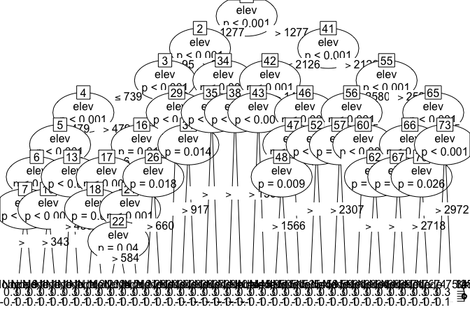
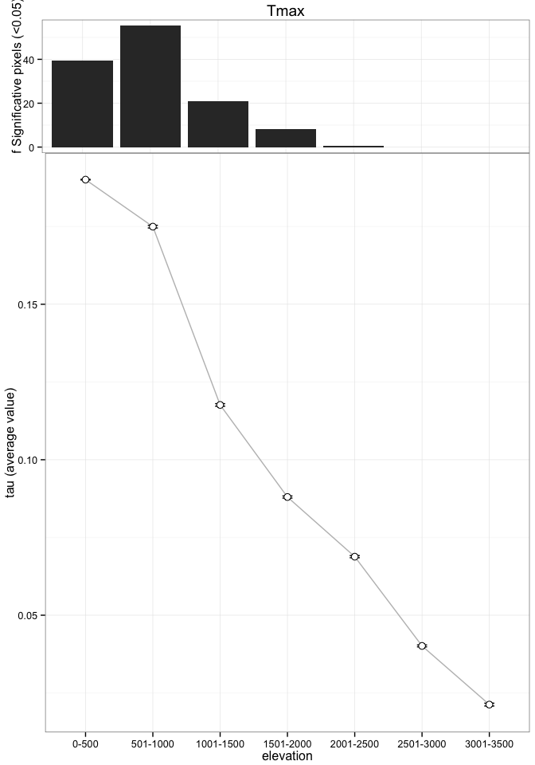
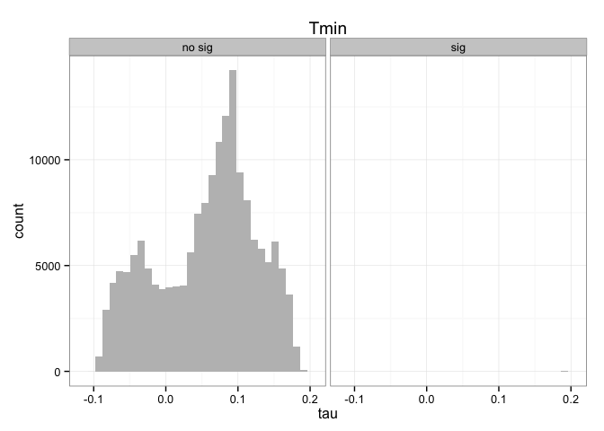
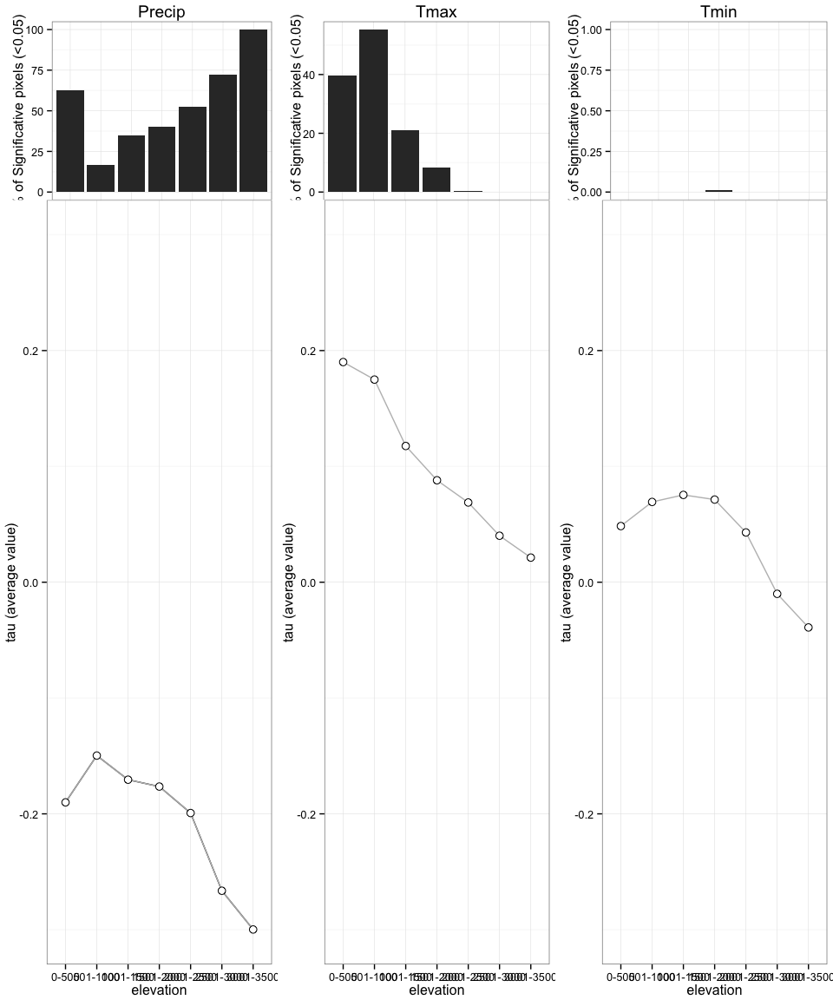

Análisis datos de clima del pasado
==================================

``` r
# -----------------------------------------------------------
# Title: climateDataDossier.R  
# Script to analyze the Sierra Nevada climate data 
# version: 1.0 
# date: Nov 2014
# Authors: Perez-Luque, AJ @ajpelu <ajperez@ugr.es>
#          Perez-Perez R @rperezperez 
#          Bonet, FJ @fjbonet 
# -----------------------------------------------------------
```

Cargamos librerias

``` r
# -----------------------------------------------------------
# Load packages
library('ggplot2') # To plot maps
library('plyr')
library('dplyr')
library('devtools')
library('gdata')
library('gplots')
library('gridExtra')
library('party') #cart 
source_url('https://raw.githubusercontent.com/ajpelu/ajpeluR/master/R/summarySE.R') # Summary function
source_url('https://raw.githubusercontent.com/ajpelu/ajpeluR/master/R/exportggplot.R') # Export function  
# -----------------------------------------------------------
```

Preparamos datos
----------------

Vamos a cargar los archivos de datos del pasado para las tres variables: `precip`, `tmax` y `tmin`. Para cada pixel y por cada variable tenemos varios atributos:

-   **Estadístico tau** (Mann-Kendall Trend Analysis). Su valor varía entre `-1` y `1`
-   ***p-value***
-   elevación
-   pertenencia a espacio natural

En este análisis nos centramos solamente en los pixeles que pertenecen a Sierra Nevada

``` r
# -----------------------------------------------------------
# Prepare Data 
# Set directory 
di <- '/Users/ajpelu/Dropbox/MS/DOSSIER2013_FICHAS/CLIMA/clima_dossier'
setwd(di)

# Read data of climate variables, elevation and natural park. 
past_precip <- read.csv(file=paste(di,'/data/past_precip.csv', sep=''), head=TRUE, sep=";", dec=".")
past_tmax <- read.csv(file=paste(di,'/data/past_tmax.csv', sep=''), head=TRUE, sep=";", dec=".")
past_tmin <- read.csv(file=paste(di,'/data/past_tmin.csv', sep=''), head=TRUE, sep=";", dec=".")

en <- read.csv(file=paste(di,'/data/espacio_natural.csv', sep=''), head=TRUE, sep=";", dec=".")
elev <- read.csv(file=paste(di,'/data/elevation.csv', sep=''), head=TRUE, sep=",", dec=".")

# Join elevation and natural park data 
eleven <- join(elev, en, type='full', by='cli_celda_id')
names(eleven) <- c('cli_celda_id','elev','pn')

# Change NA by 0, and 13 by 1 in 'pn' field
eleven[is.na(eleven)] <- 0
eleven$pn <- ifelse(eleven$pn == 13, 1, eleven$pn)

# Join elevation and pn data with climatic variables 
p_precip <- join(past_precip, eleven, type='inner', by='cli_celda_id')
p_tmax <- join(past_tmax, eleven, type='inner', by='cli_celda_id')
p_tmin <- join(past_tmin, eleven, type='inner', by='cli_celda_id')
# -----------------------------------------------------------
```

Precipitación
-------------

Caracterización de las tendencias.

``` r
# -----------------------------------------------------------
# Analisis de clima pasado (vamos a centrarnos solo en sn)

#### Precipitacion 
p_precip_sn <- filter(p_precip, pn > 0) 

# 1 # ¿¿Como es la tendencia en la precipitación para SN? 

# 1 a # Tau positivo
# How many pixels have a positive trend? (positive tau values = have increased the precipitation value) 
nrow(p_precip_sn[p_precip_sn$tau>0,])
```

    ## [1] 298

``` r
# percentage 
(nrow(p_precip_sn[p_precip_sn$tau>0,])/nrow(p_precip_sn))*100 
```

    ## [1] 0.1734

``` r
# Cuantos de ellos son significativos 
nrow(filter(p_precip_sn, tau > 0, p_value < 0.05)) 
```

    ## [1] 0

``` r
#percentage (del total de taus positivos)
(nrow(filter(p_precip_sn, tau > 0, p_value < 0.05))/nrow(filter(p_precip_sn, tau > 0)))*100
```

    ## [1] 0

``` r
#percentage (del total de pixeles de SN)
(nrow(filter(p_precip_sn, tau > 0, p_value < 0.05))/nrow(p_precip_sn))*100
```

    ## [1] 0

``` r
# 1 b # Tau negativo
# How many pixels have a negative trend? (negative tau values = have decreased the precipitation value) 
nrow(p_precip_sn[p_precip_sn$tau<0,])
```

    ## [1] 171460

``` r
# percentage 
(nrow(p_precip_sn[p_precip_sn$tau<0,])/nrow(p_precip_sn))*100 
```

    ## [1] 99.79

``` r
# Cuantos de ellos son significativos 
nrow(filter(p_precip_sn, tau < 0, p_value < 0.05)) 
```

    ## [1] 74516

``` r
#percentage (del total de taus negativos)
(nrow(filter(p_precip_sn, tau < 0, p_value < 0.05))/nrow(filter(p_precip_sn, tau < 0)))*100
```

    ## [1] 43.46

``` r
#percentage (del total de pixeles de SN)
(nrow(filter(p_precip_sn, tau < 0, p_value < 0.05))/nrow(p_precip_sn))*100
```

    ## [1] 43.37

Algunos ***resultados sobre las tendencias***:

-   298 pixeles (0.1734 %) presentan una tendencia positiva. Existen 0 con `tau > 0` y `pvalue < 0.05` (significativos), lo que representa un 0 % del total de los pixels con tau positivo y un 0 % del total de pixeles para Sierra Nevada.
-   171460 pixeles (99.7945 %) presentan una tendencia negativa. Existen 74516 pixeles con `tau < 0` y `pvalue < 0.05`, lo que representa un 43.4597 % del total de los pixels con tau negativo y un 43.3704 % del total de pixeles para Sierra Nevada.

Seguidamente categorizamos las tendencias en significativas y no significativas usando el criterio `alpha < 0.05`, y observamos la distribución de frecuencias en los tau para ambas categorias.

``` r
# 2 # Categorizacion de las tendencias 
set.seed(0) 
# Add a variable to categorize significances 
p_precip_sn$sig <- ifelse(p_precip_sn$p_value < 0.05, 'sig', 'no sig') 

ggplot(p_precip_sn, aes(x=tau)) + geom_histogram(stat='bin', bindwidth=.1, fill='grey') + 
  facet_wrap(~sig) + theme_bw() + ggtitle('Precip')
```

    ## stat_bin: binwidth defaulted to range/30. Use 'binwidth = x' to adjust this.
    ## stat_bin: binwidth defaulted to range/30. Use 'binwidth = x' to adjust this.


Evaluamos la relación entre la elevación y el valor de tau en los pixeles con el objetivo de ver grupos de elevaciones homogéneos.

``` r
# 3 # Relaci??n de las tendencias con la elevaci??n (CART)
fit <- ctree(tau~elev, data=p_precip_sn)
fit 
```

    ## 
    ##   Conditional inference tree with 25 terminal nodes
    ## 
    ## Response:  tau 
    ## Input:  elev 
    ## Number of observations:  171813 
    ## 
    ## 1) elev <= 2368; criterion = 1, statistic = 8433.913
    ##   2) elev <= 2126; criterion = 1, statistic = 944.605
    ##     3) elev <= 1031; criterion = 1, statistic = 334.592
    ##       4) elev <= 499; criterion = 1, statistic = 269.312
    ##         5) elev <= 416; criterion = 1, statistic = 1229.214
    ##           6) elev <= 341; criterion = 1, statistic = 520.58
    ##             7) elev <= 299; criterion = 1, statistic = 72.953
    ##               8) elev <= 286; criterion = 0.993, statistic = 7.401
    ##                 9)*  weights = 42 
    ##               8) elev > 286
    ##                 10)*  weights = 31 
    ##             7) elev > 299
    ##               11) elev <= 321; criterion = 1, statistic = 16.236
    ##                 12)*  weights = 294 
    ##               11) elev > 321
    ##                 13)*  weights = 212 
    ##           6) elev > 341
    ##             14) elev <= 384; criterion = 1, statistic = 92.78
    ##               15) elev <= 373; criterion = 1, statistic = 18.064
    ##                 16)*  weights = 276 
    ##               15) elev > 373
    ##                 17)*  weights = 177 
    ##             14) elev > 384
    ##               18)*  weights = 335 
    ##         5) elev > 416
    ##           19) elev <= 458; criterion = 1, statistic = 164.784
    ##             20) elev <= 433; criterion = 1, statistic = 21.721
    ##               21)*  weights = 267 
    ##             20) elev > 433
    ##               22)*  weights = 372 
    ##           19) elev > 458
    ##             23) elev <= 479; criterion = 0.999, statistic = 10.973
    ##               24)*  weights = 243 
    ##             23) elev > 479
    ##               25)*  weights = 267 
    ##       4) elev > 499
    ##         26)*  weights = 16942 
    ##     3) elev > 1031
    ##       27) elev <= 1666; criterion = 1, statistic = 89.086
    ##         28) elev <= 1406; criterion = 0.995, statistic = 8.015
    ##           29)*  weights = 31318 
    ##         28) elev > 1406
    ##           30)*  weights = 29698 
    ##       27) elev > 1666
    ##         31)*  weights = 47454 
    ##   2) elev > 2126
    ##     32) elev <= 2308; criterion = 1, statistic = 19.284
    ##       33)*  weights = 13611 
    ##     32) elev > 2308
    ##       34)*  weights = 3911 
    ## 1) elev > 2368
    ##   35) elev <= 2635; criterion = 1, statistic = 1478.207
    ##     36) elev <= 2491; criterion = 1, statistic = 86.165
    ##       37) elev <= 2409; criterion = 0.973, statistic = 4.872
    ##         38)*  weights = 2560 
    ##       37) elev > 2409
    ##         39)*  weights = 4527 
    ##     36) elev > 2491
    ##       40) elev <= 2550; criterion = 0.997, statistic = 8.86
    ##         41)*  weights = 2783 
    ##       40) elev > 2550
    ##         42)*  weights = 3671 
    ##   35) elev > 2635
    ##     43) elev <= 2873; criterion = 1, statistic = 221.318
    ##       44) elev <= 2727; criterion = 0.999, statistic = 10.607
    ##         45)*  weights = 3306 
    ##       44) elev > 2727
    ##         46)*  weights = 4585 
    ##     43) elev > 2873
    ##       47) elev <= 2920; criterion = 0.968, statistic = 4.587
    ##         48)*  weights = 1182 
    ##       47) elev > 2920
    ##         49)*  weights = 3749

``` r
plot(fit)
```


Realizamos una clasificación de las elevaciones en grupos de 500 metros y obtenemos los estadisticos descriptivos por categoría de elevación.

``` r
# 4 # Categorizacion de las elevaciones 
# Clasificacion elevaciones
p_precip_sn$elevC <- as.factor(ifelse(p_precip_sn$elev > 3001, '3001-3500',
                            ifelse(p_precip_sn$elev > 2501, '2501-3000',
                            ifelse(p_precip_sn$elev > 2001, '2001-2500',
                            ifelse(p_precip_sn$elev > 1501, '1501-2000',        
                            ifelse(p_precip_sn$elev > 1001, '1001-1500', 
                            ifelse(p_precip_sn$elev > 501, '501-1000', '0-500')))))))
                                
# Reorder las elevaciones
p_precip_sn$elevC <- reorder.factor(p_precip_sn$elevC, new.order=c("0-500","501-1000","1001-1500","1501-2000","2001-2500","2501-3000","3001-3500"))

# Obtener los summary datos de los taus
aux.prec <- ddply(p_precip_sn, c('elevC', 'sig'), summarise,
            n= length(tau),
            mean= mean(tau),
            sd= sd(tau),
            se= sd / sqrt (n),
            .drop=FALSE)

aux1.prec <- ddply(p_precip_sn, c('elevC'), summarise,
            n.group.elev = length(tau),
            mean.group.elev = mean(tau),
            sd.group.elev = sd(tau),
            se.group.elev = sd.group.elev / sqrt (n.group.elev))

summa_p_precip_sn <- join(aux.prec, aux1.prec, type='full', by='elevC', match='all')
summa_p_precip_sn$per.sig <- ( summa_p_precip_sn$n / summa_p_precip_sn$n.group.elev )*100
options(width=120)
summa_p_precip_sn
```

    ##        elevC    sig     n     mean       sd        se n.group.elev mean.group.elev sd.group.elev se.group.elev per.sig
    ## 1      0-500 no sig   985 -0.17408 0.012650 0.0004031         2642         -0.1901       0.01514     0.0002945   37.28
    ## 2      0-500    sig  1657 -0.19961 0.005203 0.0001278         2642         -0.1901       0.01514     0.0002945   62.72
    ## 3   501-1000 no sig 12687 -0.11567 0.035046 0.0003111        15246         -0.1497       0.08352     0.0006764   83.22
    ## 4   501-1000    sig  2559 -0.31823 0.036439 0.0007203        15246         -0.1497       0.08352     0.0006764   16.78
    ## 5  1001-1500 no sig 28509 -0.08792 0.036492 0.0002161        43619         -0.1705       0.12335     0.0005906   65.36
    ## 6  1001-1500    sig 15110 -0.32632 0.065302 0.0005312        43619         -0.1705       0.12335     0.0005906   34.64
    ## 7  1501-2000 no sig 33345 -0.08107 0.048080 0.0002633        55585         -0.1764       0.13154     0.0005579   59.99
    ## 8  1501-2000    sig 22240 -0.31941 0.075526 0.0005064        55585         -0.1764       0.13154     0.0005579   40.01
    ## 9  2001-2500 no sig 17154 -0.07248 0.052140 0.0003981        35933         -0.1993       0.13706     0.0007231   47.74
    ## 10 2001-2500    sig 18779 -0.31511 0.073221 0.0005343        35933         -0.1993       0.13706     0.0007231   52.26
    ## 11 2501-3000 no sig  4617 -0.12763 0.049188 0.0007239        16562         -0.2664       0.10904     0.0008473   27.88
    ## 12 2501-3000    sig 11945 -0.32005 0.072307 0.0006616        16562         -0.2664       0.10904     0.0008473   72.12
    ## 13 3001-3500 no sig     0      NaN      NaN       NaN         2226         -0.2998       0.06301     0.0013355    0.00
    ## 14 3001-3500    sig  2226 -0.29985 0.063009 0.0013355         2226         -0.2998       0.06301     0.0013355  100.00

Finalmente realizamos un plot combinado en el que mostramos el valor promedio de tau para los pixeles de la misma categoría de elevación, así como el porcentaje de pixeles con tendencias significativas por categoría de elevación.

``` r
# 5 # Plot combinado (Ojo solo los significativos). 
df.precip <- summa_p_precip_sn[summa_p_precip_sn$sig == 'sig',]
g.top.precip <- ggplot(df.precip, aes(x = elevC, y = per.sig)) +
  geom_bar(stat='identity') +
  theme_bw() + ylab('% of Significative pixels (<0.05)') + 
  theme(plot.margin = unit(c(1,5,-30,6),units="points"),
        axis.title.y = element_text(vjust =0.25)) +
  ggtitle('Precip')
# g.top.precip 

g.bottom.precip <- ggplot(df.precip, aes(x=elevC, y=mean.group.elev, group=1)) + geom_line() + 
  geom_errorbar(aes(ymax = mean.group.elev + se.group.elev, ymin= mean.group.elev - se.group.elev), width=.15) + 
  geom_line(col='grey') + geom_point(size=3, shape=21, fill="white") + 
  theme_bw() + xlab('elevation') + ylab('tau (average value)')+ 
  theme(plot.margin = unit(c(0,5,1,1),units="points")) 

# g.bottom.precip  

grid.arrange(arrangeGrob(g.top.precip, g.bottom.precip, ncol=1, nrow=2, heights = c(1/5, 4/5)))
```


Tmax
----

Caracterización de las tendencias.

``` r
# -----------------------------------------------------------
## Tmax 
p_tmax_sn <- filter(p_tmax, pn > 0) 

# 1 # ??Como es la tendencia en la tmax para SN? 

# 1 a # Tau positivo
# How many pixels have a positive trend? (positive tau values = have increased the tmax value) 
nrow(p_tmax_sn[p_tmax_sn$tau>0,])
```

    ## [1] 141757

``` r
# percentage 
(nrow(p_tmax_sn[p_tmax_sn$tau>0,])/nrow(p_tmax_sn))*100 
```

    ## [1] 82.51

``` r
# Cuantos de ellos son significativos 
nrow(filter(p_tmax_sn, tau > 0, p_value < 0.05)) 
```

    ## [1] 23417

``` r
#percentage (del total de taus positivos)
(nrow(filter(p_tmax_sn, tau > 0, p_value < 0.05))/nrow(filter(p_tmax_sn, tau > 0)))*100
```

    ## [1] 16.52

``` r
#percentage (del total de pixeles de SN)
(nrow(filter(p_tmax_sn, tau > 0, p_value < 0.05))/nrow(p_tmax_sn))*100
```

    ## [1] 13.63

``` r
# 1 b # Tau negativo
# How many pixels have a negative trend? (negative tau values = have decreased the tmax value) 
nrow(p_tmax_sn[p_tmax_sn$tau<0,])
```

    ## [1] 29551

``` r
# percentage 
(nrow(p_tmax_sn[p_tmax_sn$tau<0,])/nrow(p_tmax_sn))*100 
```

    ## [1] 17.2

``` r
# Cuantos de ellos son significativos 
nrow(filter(p_tmax_sn, tau < 0, p_value < 0.05)) 
```

    ## [1] 0

``` r
#percentage (del total de taus negativos)
(nrow(filter(p_tmax_sn, tau < 0, p_value < 0.05))/nrow(filter(p_tmax_sn, tau < 0)))*100
```

    ## [1] 0

``` r
#percentage (del total de pixeles de SN)
(nrow(filter(p_tmax_sn, tau < 0, p_value < 0.05))/nrow(p_tmax_sn))*100
```

    ## [1] 0

Algunos ***resultados sobre las tendencias***:

-   141757 pixeles (82.5066 %) presentan una tendencia positiva. Existen 23417 con `tau > 0` y `pvalue < 0.05` (significativos), lo que representa un 16.5191 % del total de los pixels con tau positivo y un 13.6294 % del total de pixeles para Sierra Nevada.
-   29551 pixeles (17.1995 %) presentan una tendencia negativa. Existen 0 pixeles con `tau < 0` y `pvalue < 0.05`, lo que representa un 0 % del total de los pixels con tau negativo y un 0 % del total de pixeles para Sierra Nevada.

Seguidamente categorizamos las tendencias en significativas y no significativas usando el criterio `alpha < 0.05`, y observamos la distribución de frecuencias en los tau para ambas categorias.

``` r
# 2 # Categorizacion de las tendencias 
set.seed(0) 
# Add a variable to categorize significances 
p_tmax_sn$sig <- ifelse(p_tmax_sn$p_value < 0.05, 'sig', 'no sig') 

ggplot(p_tmax_sn, aes(x=tau)) + geom_histogram(stat='bin', bindwidth=.1, fill='grey') + 
  facet_wrap(~sig) + theme_bw() + ggtitle('Tmax')
```

    ## stat_bin: binwidth defaulted to range/30. Use 'binwidth = x' to adjust this.
    ## stat_bin: binwidth defaulted to range/30. Use 'binwidth = x' to adjust this.


Evaluamos la relación entre la elevación y el valor de tau en los pixeles con el objetivo de ver grupos de elevaciones homogéneos.

``` r
# 3 # Relaci??n de las tendencias con la elevaci??n (CART)
fit <- ctree(tau~elev, data=p_tmax_sn)
fit 
```

    ## 
    ##   Conditional inference tree with 38 terminal nodes
    ## 
    ## Response:  tau 
    ## Input:  elev 
    ## Number of observations:  171813 
    ## 
    ## 1) elev <= 1277; criterion = 1, statistic = 36121.445
    ##   2) elev <= 957; criterion = 1, statistic = 4486.456
    ##     3) elev <= 739; criterion = 1, statistic = 888.174
    ##       4) elev <= 479; criterion = 1, statistic = 528.515
    ##         5) elev <= 384; criterion = 1, statistic = 607.678
    ##           6) elev <= 318; criterion = 1, statistic = 111.745
    ##             7) elev <= 298; criterion = 0.999, statistic = 12.026
    ##               8)*  weights = 70 
    ##             7) elev > 298
    ##               9)*  weights = 168 
    ##           6) elev > 318
    ##             10) elev <= 343; criterion = 1, statistic = 15.879
    ##               11)*  weights = 354 
    ##             10) elev > 343
    ##               12)*  weights = 440 
    ##         5) elev > 384
    ##           13) elev <= 439; criterion = 1, statistic = 92.059
    ##             14)*  weights = 689 
    ##           13) elev > 439
    ##             15)*  weights = 528 
    ##       4) elev > 479
    ##         16) elev <= 659; criterion = 0.982, statistic = 5.559
    ##           17) elev <= 519; criterion = 1, statistic = 64.029
    ##             18) elev <= 492; criterion = 0.992, statistic = 6.983
    ##               19)*  weights = 198 
    ##             18) elev > 492
    ##               20)*  weights = 414 
    ##           17) elev > 519
    ##             21) elev <= 644; criterion = 1, statistic = 14.346
    ##               22) elev <= 584; criterion = 0.96, statistic = 4.211
    ##                 23)*  weights = 1252 
    ##               22) elev > 584
    ##                 24)*  weights = 1156 
    ##             21) elev > 644
    ##               25)*  weights = 231 
    ##         16) elev > 659
    ##           26) elev <= 660; criterion = 0.982, statistic = 5.566
    ##             27)*  weights = 102 
    ##           26) elev > 660
    ##             28)*  weights = 1585 
    ##     3) elev > 739
    ##       29) elev <= 839; criterion = 1, statistic = 70.217
    ##         30)*  weights = 3003 
    ##       29) elev > 839
    ##         31) elev <= 917; criterion = 0.986, statistic = 6.076
    ##           32)*  weights = 3256 
    ##         31) elev > 917
    ##           33)*  weights = 2016 
    ##   2) elev > 957
    ##     34) elev <= 1154; criterion = 1, statistic = 568.675
    ##       35) elev <= 1033; criterion = 1, statistic = 36.344
    ##         36)*  weights = 4114 
    ##       35) elev > 1033
    ##         37)*  weights = 7168 
    ##     34) elev > 1154
    ##       38) elev <= 1206; criterion = 1, statistic = 41.159
    ##         39)*  weights = 4027 
    ##       38) elev > 1206
    ##         40)*  weights = 6255 
    ## 1) elev > 1277
    ##   41) elev <= 2126; criterion = 1, statistic = 10347.089
    ##     42) elev <= 1434; criterion = 1, statistic = 1376.011
    ##       43) elev <= 1369; criterion = 1, statistic = 51.173
    ##         44)*  weights = 9578 
    ##       43) elev > 1369
    ##         45)*  weights = 7325 
    ##     42) elev > 1434
    ##       46) elev <= 1886; criterion = 1, statistic = 458.473
    ##         47) elev <= 1671; criterion = 1, statistic = 67.797
    ##           48) elev <= 1566; criterion = 0.991, statistic = 6.803
    ##             49)*  weights = 14900 
    ##           48) elev > 1566
    ##             50)*  weights = 12231 
    ##         47) elev > 1671
    ##           51)*  weights = 24807 
    ##       46) elev > 1886
    ##         52) elev <= 1999; criterion = 1, statistic = 37.417
    ##           53)*  weights = 11009 
    ##         52) elev > 1999
    ##           54)*  weights = 11052 
    ##   41) elev > 2126
    ##     55) elev <= 2580; criterion = 1, statistic = 3434.454
    ##       56) elev <= 2395; criterion = 1, statistic = 284.38
    ##         57) elev <= 2307; criterion = 0.978, statistic = 5.233
    ##           58)*  weights = 13547 
    ##         57) elev > 2307
    ##           59)*  weights = 5685 
    ##       56) elev > 2395
    ##         60) elev <= 2469; criterion = 1, statistic = 45.307
    ##           61)*  weights = 4246 
    ##         60) elev > 2469
    ##           62) elev <= 2520; criterion = 0.952, statistic = 3.903
    ##             63)*  weights = 2483 
    ##           62) elev > 2520
    ##             64)*  weights = 2779 
    ##     55) elev > 2580
    ##       65) elev <= 2805; criterion = 1, statistic = 680.364
    ##         66) elev <= 2685; criterion = 1, statistic = 89.872
    ##           67) elev <= 2634; criterion = 0.991, statistic = 6.735
    ##             68)*  weights = 2288 
    ##           67) elev > 2634
    ##             69)*  weights = 1863 
    ##         66) elev > 2685
    ##           70) elev <= 2718; criterion = 0.974, statistic = 4.939
    ##             71)*  weights = 1147 
    ##           70) elev > 2718
    ##             72)*  weights = 2864 
    ##       65) elev > 2805
    ##         73) elev <= 2972; criterion = 1, statistic = 120.677
    ##           74)*  weights = 4250 
    ##         73) elev > 2972
    ##           75)*  weights = 2733

``` r
plot(fit)
```



Realizamos una clasificación de las elevaciones en grupos de 500 metros y obtenemos los estadisticos descriptivos por categoría de elevación.

``` r
# 4 # Categorizacion de las elevaciones 
# Clasificacion elevaciones
p_tmax_sn$elevC <- as.factor(ifelse(p_tmax_sn$elev > 3001, '3001-3500',
                             ifelse(p_tmax_sn$elev > 2501, '2501-3000',
                             ifelse(p_tmax_sn$elev > 2001, '2001-2500',
                             ifelse(p_tmax_sn$elev > 1501, '1501-2000',        
                             ifelse(p_tmax_sn$elev > 1001, '1001-1500', 
                             ifelse(p_tmax_sn$elev > 501, '501-1000', '0-500')))))))

# Reorder las elevaciones
p_tmax_sn$elevC <- reorder.factor(p_tmax_sn$elevC, new.order=c("0-500","501-1000","1001-1500","1501-2000","2001-2500","2501-3000","3001-3500"))

# Obtener los summary datos de los taus
aux.tmax <- ddply(p_tmax_sn, c('elevC', 'sig'), summarise,
             n= length(tau),
             mean= mean(tau),
             sd= sd(tau),
             se= sd / sqrt (n),
             .drop=FALSE)

aux1.tmax <- ddply(p_tmax_sn, c('elevC'), summarise,
                   n.group.elev = length(tau),
                   mean.group.elev = mean(tau),
                   sd.group.elev = sd(tau),
                   se.group.elev = sd.group.elev / sqrt (n.group.elev))

summa_p_tmax_sn <- join(aux.tmax, aux1.tmax, type='full', by='elevC', match='all')
summa_p_tmax_sn$per.sig <- ( summa_p_tmax_sn$n / summa_p_tmax_sn$n.group.elev)*100
options(width=120)
summa_p_tmax_sn
```

    ##        elevC    sig     n    mean       sd        se n.group.elev mean.group.elev sd.group.elev se.group.elev  per.sig
    ## 1      0-500 no sig  1596 0.18700 0.003549 8.883e-05         2642         0.19007      0.005155     0.0001003  60.4088
    ## 2      0-500    sig  1046 0.19474 0.003421 1.058e-04         2642         0.19007      0.005155     0.0001003  39.5912
    ## 3   501-1000 no sig  6813 0.14104 0.062585 7.582e-04        15246         0.17496      0.052654     0.0004264  44.6871
    ## 4   501-1000    sig  8433 0.20236 0.012967 1.412e-04        15246         0.17496      0.052654     0.0004264  55.3129
    ## 5  1001-1500 no sig 34467 0.09386 0.078689 4.239e-04        43619         0.11762      0.084070     0.0004025  79.0183
    ## 6  1001-1500    sig  9152 0.20710 0.015288 1.598e-04        43619         0.11762      0.084070     0.0004025  20.9817
    ## 7  1501-2000 no sig 50943 0.07726 0.074844 3.316e-04        55585         0.08801      0.080087     0.0003397  91.6488
    ## 8  1501-2000    sig  4642 0.20599 0.011928 1.751e-04        55585         0.08801      0.080087     0.0003397   8.3512
    ## 9  2001-2500 no sig 35789 0.06831 0.064223 3.395e-04        35933         0.06883      0.064602     0.0003408  99.5993
    ## 10 2001-2500    sig   144 0.19614 0.003970 3.309e-04        35933         0.06883      0.064602     0.0003408   0.4007
    ## 11 2501-3000 no sig 16562 0.04013 0.039013 3.031e-04        16562         0.04013      0.039013     0.0003031 100.0000
    ## 12 2501-3000    sig     0     NaN      NaN       NaN        16562         0.04013      0.039013     0.0003031   0.0000
    ## 13 3001-3500 no sig  2226 0.02126 0.021365 4.528e-04         2226         0.02126      0.021365     0.0004528 100.0000
    ## 14 3001-3500    sig     0     NaN      NaN       NaN         2226         0.02126      0.021365     0.0004528   0.0000

Finalmente realizamos un plot combinado en el que mostramos el valor promedio de tau para los pixeles de la misma categoría de elevación, así como el porcentaje de pixeles con tendencias significativas por categoría de elevación.

``` r
# 5 # Plot combinado (Ojo solo los significativos). 
df.tmax <- summa_p_tmax_sn[summa_p_tmax_sn$sig == 'sig',]
g.top.tmax <- ggplot(df.tmax, aes(x = elevC, y = per.sig)) +
  geom_bar(stat='identity') +
  theme_bw() + ylab('% of Significative pixels (<0.05)') + 
  theme(plot.margin = unit(c(1,5,-30,6),units="points"),
        axis.title.y = element_text(vjust =0.25)) +
  ggtitle('Tmax')
# g.top.tmax 

g.bottom.tmax <- ggplot(df.tmax, aes(x=elevC, y=mean.group.elev, group=1)) + 
  geom_errorbar(aes(ymax = mean.group.elev + se.group.elev, ymin=mean.group.elev - se.group.elev), width=.15) + 
  geom_line(col='grey') + 
  geom_point(size=3, shape=21, fill="white") + 
  theme_bw() + xlab('elevation') + ylab('tau (average value)')+ 
  theme(plot.margin = unit(c(0,5,1,1),units="points")) 

# g.bottom.tmax 

grid.arrange(arrangeGrob(g.top.tmax, g.bottom.tmax, ncol=1, nrow=2, heights = c(1/5, 4/5)))
```



Tmin
----

Caracterización de las tendencias.

``` r
# Tmin
p_tmin_sn <- filter(p_tmin, pn > 0) 

# 1 # ??Como es la tendencia en la tmax para SN? 

# 1 a # Tau positivo
# How many pixels have a positive trend? (positive tau values = have increased the tmax value) 
nrow(p_tmin_sn[p_tmin_sn$tau>0,])
```

    ## [1] 129759

``` r
# percentage 
(nrow(p_tmin_sn[p_tmin_sn$tau>0,])/nrow(p_tmin_sn))*100 
```

    ## [1] 75.52

``` r
# Cuantos de ellos son significativos 
nrow(filter(p_tmin_sn, tau > 0, p_value < 0.05)) 
```

    ## [1] 7

``` r
#percentage (del total de taus positivos)
(nrow(filter(p_tmin_sn, tau > 0, p_value < 0.05))/nrow(filter(p_tmin_sn, tau > 0)))*100
```

    ## [1] 0.005395

``` r
#percentage (del total de pixeles de SN)
(nrow(filter(p_tmin_sn, tau > 0, p_value < 0.05))/nrow(p_tmin_sn))*100
```

    ## [1] 0.004074

``` r
# 1 b # Tau negativo
# How many pixels have a negative trend? (negative tau values = have decreased the tmax value) 
nrow(p_tmin_sn[p_tmin_sn$tau<0,])
```

    ## [1] 41762

``` r
# percentage 
(nrow(p_tmin_sn[p_tmin_sn$tau<0,])/nrow(p_tmin_sn))*100 
```

    ## [1] 24.31

``` r
# Cuantos de ellos son significativos 
nrow(filter(p_tmin_sn, tau < 0, p_value < 0.05)) 
```

    ## [1] 0

``` r
#percentage (del total de taus negativos)
(nrow(filter(p_tmin_sn, tau < 0, p_value < 0.05))/nrow(filter(p_tmin_sn, tau < 0)))*100
```

    ## [1] 0

``` r
#percentage (del total de pixeles de SN)
(nrow(filter(p_tmin_sn, tau < 0, p_value < 0.05))/nrow(p_tmin_sn))*100
```

    ## [1] 0

Algunos ***resultados sobre las tendencias***:

-   129759 pixeles (75.5234 %) presentan una tendencia positiva. Existen 7 con `tau > 0` y `pvalue < 0.05` (significativos), lo que representa un 0.0054 % del total de los pixels con tau positivo y un 0.0041 % del total de pixeles para Sierra Nevada.
-   41762 pixeles (24.3067 %) presentan una tendencia negativa. Existen 0 pixeles con `tau < 0` y `pvalue < 0.05`, lo que representa un 0 % del total de los pixels con tau negativo y un 0 % del total de pixeles para Sierra Nevada.

Seguidamente categorizamos las tendencias en significativas y no significativas usando el criterio `alpha < 0.05`, y observamos la distribución de frecuencias en los tau para ambas categorias.

``` r
# 2 # Categorizacion de las tendencias 
set.seed(0) 
# Add a variable to categorize significances 
p_tmin_sn$sig <- ifelse(p_tmin_sn$p_value < 0.05, 'sig', 'no sig') 

ggplot(p_tmin_sn, aes(x=tau)) + geom_histogram(stat='bin', bindwidth=.1, fill='grey') + 
  facet_wrap(~sig) + theme_bw() + ggtitle('Tmin')
```

    ## stat_bin: binwidth defaulted to range/30. Use 'binwidth = x' to adjust this.
    ## stat_bin: binwidth defaulted to range/30. Use 'binwidth = x' to adjust this.



Evaluamos la relación entre la elevación y el valor de tau en los pixeles con el objetivo de ver grupos de elevaciones homogéneos.

``` r
# 3 # Relaci??n de las tendencias con la elevaci??n (CART)
fit <- ctree(tau~elev, data=p_tmin_sn)
fit 
```

    ## 
    ##   Conditional inference tree with 21 terminal nodes
    ## 
    ## Response:  tau 
    ## Input:  elev 
    ## Number of observations:  171813 
    ## 
    ## 1) elev <= 2320; criterion = 1, statistic = 17754.317
    ##   2) elev <= 2045; criterion = 1, statistic = 703.705
    ##     3) elev <= 600; criterion = 0.999, statistic = 11.669
    ##       4) elev <= 508; criterion = 1, statistic = 395.439
    ##         5)*  weights = 2732 
    ##       4) elev > 508
    ##         6) elev <= 560; criterion = 1, statistic = 47.904
    ##           7)*  weights = 956 
    ##         6) elev > 560
    ##           8)*  weights = 767 
    ##     3) elev > 600
    ##       9) elev <= 1827; criterion = 1, statistic = 69.867
    ##         10) elev <= 1197; criterion = 1, statistic = 45.947
    ##           11)*  weights = 25490 
    ##         10) elev > 1197
    ##           12) elev <= 1663; criterion = 1, statistic = 129.801
    ##             13)*  weights = 50179 
    ##           12) elev > 1663
    ##             14)*  weights = 19532 
    ##       9) elev > 1827
    ##         15) elev <= 1869; criterion = 0.999, statistic = 11.739
    ##           16)*  weights = 4375 
    ##         15) elev > 1869
    ##           17)*  weights = 17024 
    ##   2) elev > 2045
    ##     18) elev <= 2159; criterion = 1, statistic = 148.757
    ##       19) elev <= 2126; criterion = 0.997, statistic = 8.706
    ##         20)*  weights = 6873 
    ##       19) elev > 2126
    ##         21)*  weights = 2549 
    ##     18) elev > 2159
    ##       22) elev <= 2284; criterion = 0.998, statistic = 9.663
    ##         23)*  weights = 9392 
    ##       22) elev > 2284
    ##         24)*  weights = 2547 
    ## 1) elev > 2320
    ##   25) elev <= 2635; criterion = 1, statistic = 3843.757
    ##     26) elev <= 2481; criterion = 1, statistic = 453.071
    ##       27) elev <= 2409; criterion = 1, statistic = 52.446
    ##         28)*  weights = 5594 
    ##       27) elev > 2409
    ##         29)*  weights = 4015 
    ##     26) elev > 2481
    ##       30) elev <= 2561; criterion = 1, statistic = 37.622
    ##         31)*  weights = 3764 
    ##       30) elev > 2561
    ##         32)*  weights = 3202 
    ##   25) elev > 2635
    ##     33) elev <= 2906; criterion = 1, statistic = 758.808
    ##       34) elev <= 2741; criterion = 1, statistic = 58.661
    ##         35) elev <= 2675; criterion = 0.988, statistic = 6.327
    ##           36)*  weights = 1428 
    ##         35) elev > 2675
    ##           37)*  weights = 2370 
    ##       34) elev > 2741
    ##         38)*  weights = 4928 
    ##     33) elev > 2906
    ##       39) elev <= 3133; criterion = 1, statistic = 89.282
    ##         40)*  weights = 3466 
    ##       39) elev > 3133
    ##         41)*  weights = 630

``` r
plot(fit)
```


Realizamos una clasificación de las elevaciones en grupos de 500 metros y obtenemos los estadisticos descriptivos por categoría de elevación.

``` r
# 4 # Categorizacion de las elevaciones 
# Clasificacion elevaciones
p_tmin_sn$elevC <- as.factor(ifelse(p_tmin_sn$elev > 3001, '3001-3500',
                             ifelse(p_tmin_sn$elev > 2501, '2501-3000',
                             ifelse(p_tmin_sn$elev > 2001, '2001-2500',
                             ifelse(p_tmin_sn$elev > 1501, '1501-2000',        
                             ifelse(p_tmin_sn$elev > 1001, '1001-1500', 
                             ifelse(p_tmin_sn$elev > 501, '501-1000', '0-500')))))))

# Reorder las elevaciones
p_tmin_sn$elevC <- reorder.factor(p_tmin_sn$elevC, new.order=c("0-500","501-1000","1001-1500","1501-2000","2001-2500","2501-3000","3001-3500"))

# Obtener los summary datos de los taus
aux.tmin <- ddply(p_tmin_sn, c('elevC', 'sig'), summarise,
             n= length(tau),
             mean= mean(tau),
             sd= sd(tau),
             se= sd / sqrt (n),
             .drop=FALSE)

aux1.tmin <- ddply(p_tmin_sn, c('elevC'), summarise,
                   n.group.elev = length(tau),
                   mean.group.elev = mean(tau),
                   sd.group.elev = sd(tau),
                   se.group.elev = sd.group.elev / sqrt (n.group.elev))

summa_p_tmin_sn <- join(aux.tmin, aux1.tmin, type='full', by='elevC', match='all')
summa_p_tmin_sn$per.sig <- round((summa_p_tmin_sn$n / summa_p_tmin_sn$n.group.elev )*100,2)
options(width=120)
summa_p_tmin_sn
```

    ##        elevC    sig     n     mean        sd        se n.group.elev mean.group.elev sd.group.elev se.group.elev per.sig
    ## 1      0-500 no sig  2642  0.04847 0.0096613 0.0001880         2642         0.04847      0.009661     0.0001880  100.00
    ## 2      0-500    sig     0      NaN       NaN       NaN         2642         0.04847      0.009661     0.0001880    0.00
    ## 3   501-1000 no sig 15246  0.06930 0.0314169 0.0002544        15246         0.06930      0.031417     0.0002544  100.00
    ## 4   501-1000    sig     0      NaN       NaN       NaN        15246         0.06930      0.031417     0.0002544    0.00
    ## 5  1001-1500 no sig 43619  0.07538 0.0589882 0.0002824        43619         0.07538      0.058988     0.0002824  100.00
    ## 6  1001-1500    sig     0      NaN       NaN       NaN        43619         0.07538      0.058988     0.0002824    0.00
    ## 7  1501-2000 no sig 55578  0.07134 0.0699646 0.0002968        55585         0.07135      0.069973     0.0002968   99.99
    ## 8  1501-2000    sig     7  0.19270 0.0008692 0.0003285        55585         0.07135      0.069973     0.0002968    0.01
    ## 9  2001-2500 no sig 35933  0.04297 0.0749572 0.0003954        35933         0.04297      0.074957     0.0003954  100.00
    ## 10 2001-2500    sig     0      NaN       NaN       NaN        35933         0.04297      0.074957     0.0003954    0.00
    ## 11 2501-3000 no sig 16562 -0.01004 0.0522267 0.0004058        16562        -0.01004      0.052227     0.0004058  100.00
    ## 12 2501-3000    sig     0      NaN       NaN       NaN        16562        -0.01004      0.052227     0.0004058    0.00
    ## 13 3001-3500 no sig  2226 -0.03907 0.0314336 0.0006662         2226        -0.03907      0.031434     0.0006662  100.00
    ## 14 3001-3500    sig     0      NaN       NaN       NaN         2226        -0.03907      0.031434     0.0006662    0.00

Finalmente realizamos un plot combinado en el que mostramos el valor promedio de tau para los pixeles de la misma categoría de elevación, así como el porcentaje de pixeles con tendencias significativas por categoría de elevación.

``` r
# 5 # Plot combinado (Ojo solo los significativos). 
df.tmin <- summa_p_tmin_sn[summa_p_tmin_sn$sig == 'sig',]
g.top.tmin <- ggplot(df.tmin, aes(x = elevC, y = per.sig)) +
  geom_bar(stat='identity') +
  theme_bw() + ylab('% of Significative pixels (<0.05)') + 
  theme(plot.margin = unit(c(1,5,-30,6),units="points"),
        axis.title.y = element_text(vjust =0.25)) + 
  ggtitle('Tmin') + ylim(0, 1)
# g.top.tmin 

g.bottom.tmin <- ggplot(df.tmin, aes(x=elevC, y=mean.group.elev, group=1)) + 
  geom_errorbar(aes(ymax = mean.group.elev + se.group.elev, ymin=mean.group.elev - se.group.elev), width=.15) + 
  geom_line(col='grey') + 
  geom_point(size=3, shape=21, fill="white") + 
  theme_bw() + xlab('elevation') + ylab('tau (average value)')+ 
  theme(plot.margin = unit(c(0,5,1,1),units="points")) 

# g.bottom 

grid.arrange(arrangeGrob(g.top.tmin, g.bottom.tmin, ncol=1, nrow=2, heights = c(1/5, 4/5)))
```


Tabla resumen

| Variable | tendencia | n      | %       | sig.  | % de los tau. | % de los totales |
|----------|-----------|--------|---------|-------|---------------|------------------|
| precip   | tau \> 0  | 298    | 0.1734  | 0     | 0             | 0                |
| precip   | tau \< 0  | 171460 | 99.7945 | 74516 | 43.4597       | 43.3704          |
| tmax     | tau\> 0   | 141757 | 82.5066 | 23417 | 16.5191       | 13.6294          |
| tmax     | tau \< 0  | 29551  | 17.1995 | 0     | 0             | 0                |
| tmin     | tau \> 0  | 129759 | 75.5234 | 7     | 0.0054        | 0.0041           |
| tmin     | tau \< 0  | 41762  | 24.3067 | 0     | 0             | 0                |

Ahora todos los plots combinados

``` r
gbtmax <- g.bottom.tmax + ylim(-0.3,.3)
gbtmin <- g.bottom.tmin + ylim(-0.3,.3)
gbprecip <- g.bottom.precip + ylim(-0.3,.3)

grid.arrange(arrangeGrob(g.top.precip, g.top.tmax, g.top.tmin, gbprecip, gbtmax, gbtmin, ncol=3, nrow=2, heights = c(1/5, 4/5)))
```

    ## Warning: Removed 4 rows containing missing values (geom_path).


