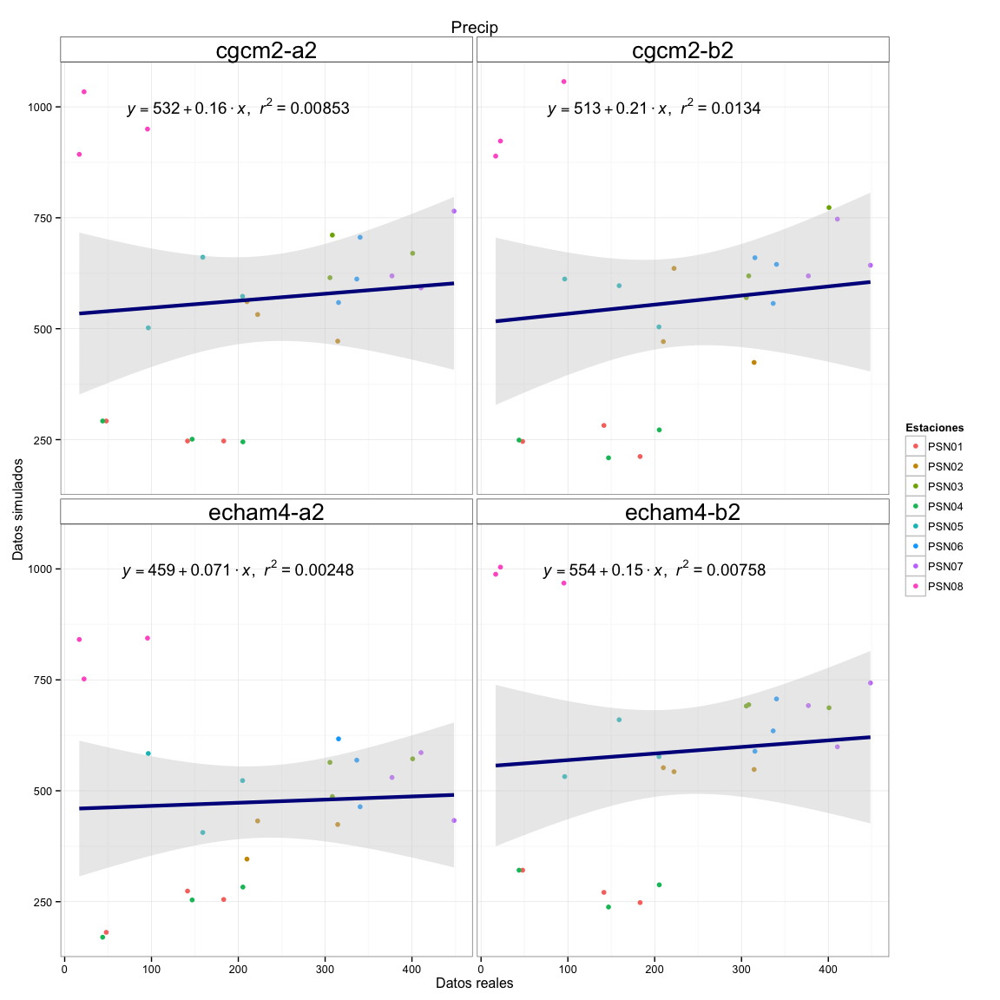
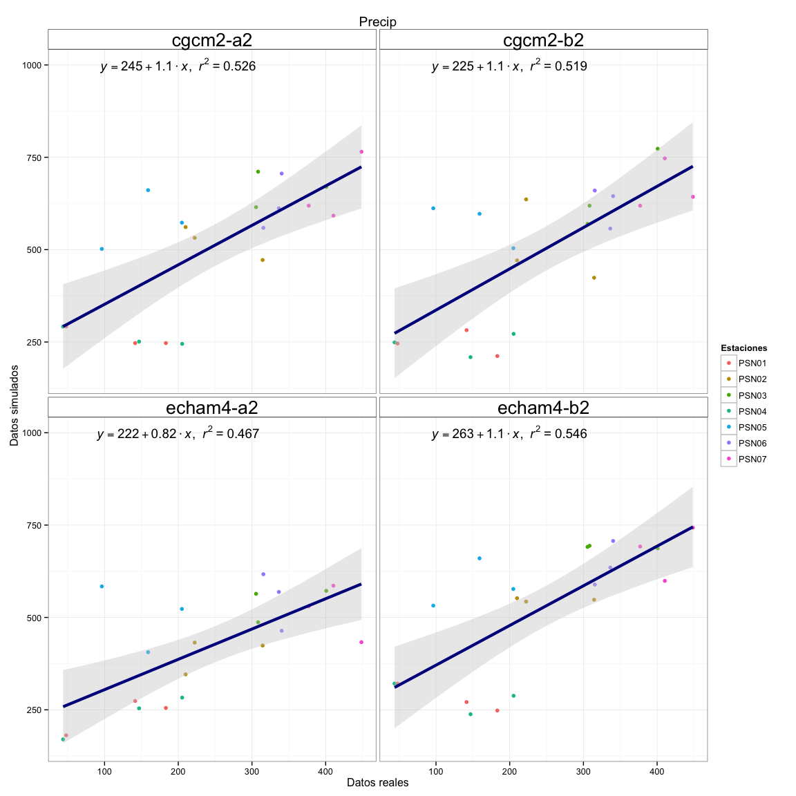
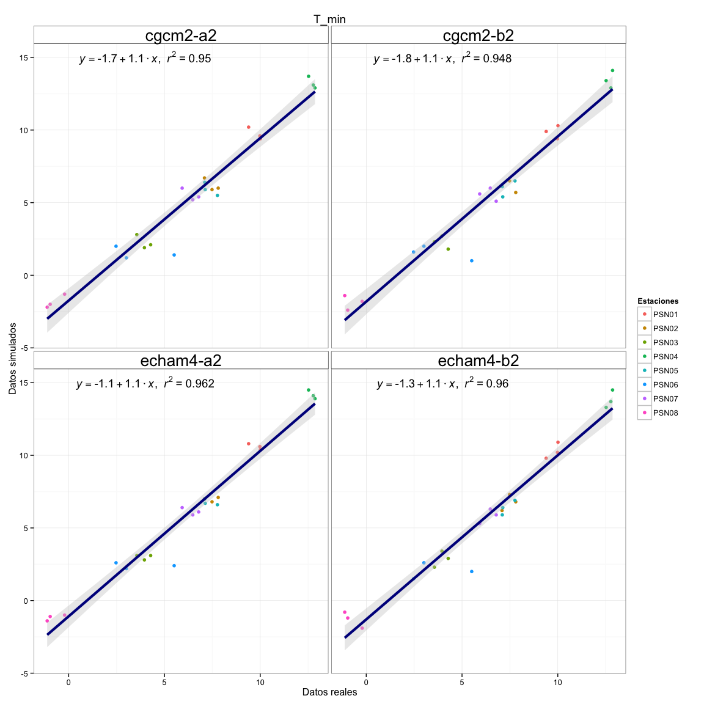
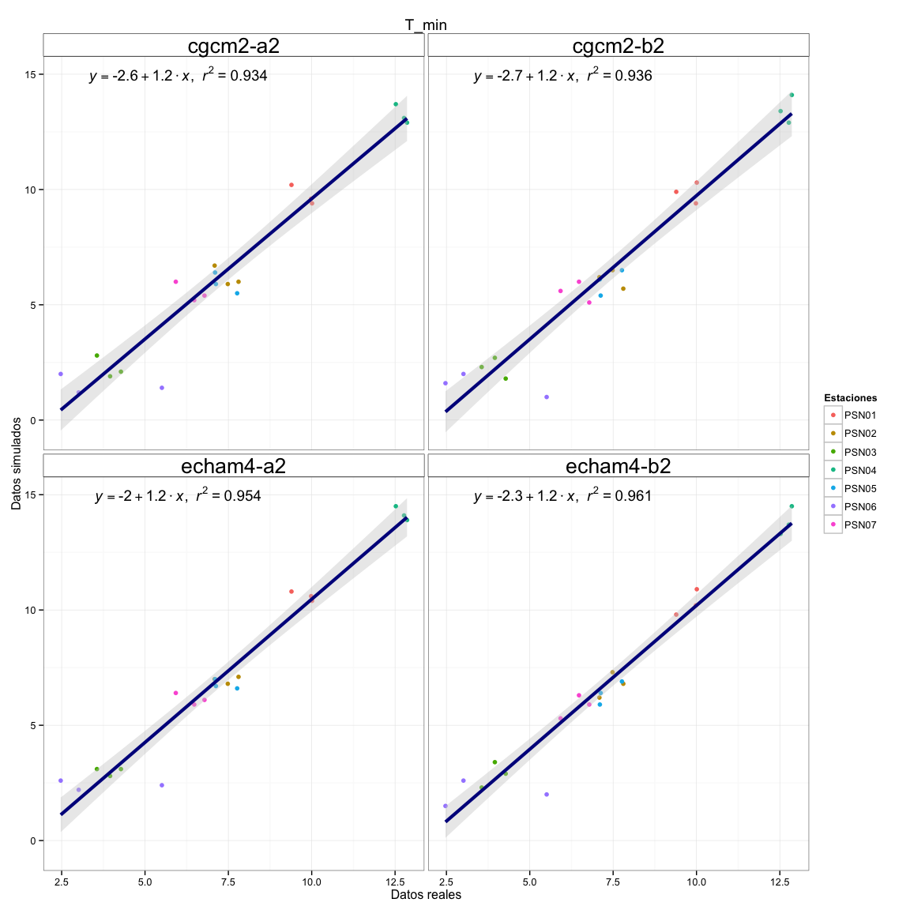
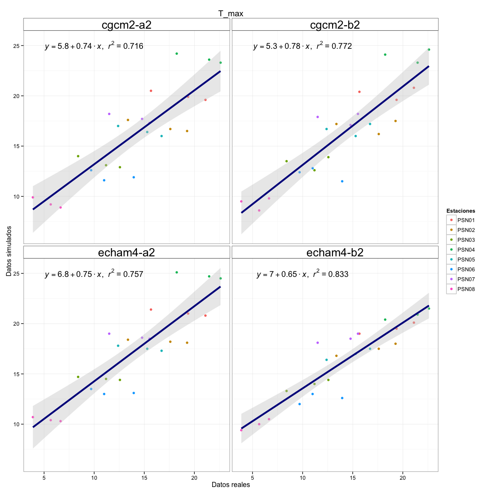
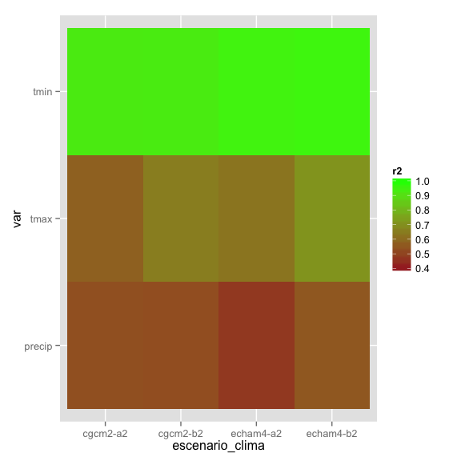

Evaluaciones datos climáticos
-----------------------------

``` r
# Title: EvaluacionSimulaciones.R  
# Script to analyze the Sierra Nevada climate data 
# version: 1.0 
# date: Nov 2014
# Authors: Perez-Luque, AJ @ajpelu <ajperez@ugr.es>
#          Perez-Perez R @rperezperez 
#          Bonet, FJ @fjbonet 
# -----------------------------------------------------------
```

Cargamos librerias

``` r
# -----------------------------------------------------------
# Load packages
library('foreign')
library('plyr')
library('lubridate') 
library('lattice')
library('latticeExtra') 
library('ggplot2')
# -----------------------------------------------------------
```

Cargamos los datos climaticos simulados para los pixeles correspondientes a las estaciones `PSN`

``` r
# -----------------------------------------------------------
# Prepare data

## Simulated data 
# set directory 
di <- '/Users/ajpelu/Dropbox/MS/DOSSIER2013_FICHAS/CLIMA/clima_dossier'

# Read data of simulation for tmin, tmax and precip for PSN cells 
sim_psn <- read.table(file=paste(di, '/data/sim_psn.csv', sep=''), sep=';', head=TRUE)
names(sim_psn)[6] <- 'year'

# Read data from shape of PSN stations 
setwd(paste(di,'/geoinfo/', sep=''))
est <- read.dbf('cli_estaciones_psn.dbf')
# Add elevation (from Report of stations)
est$elev <- c(1646, 1691,975,3070,1550,2300,2133,600)

# Read data from shape where PSN is related with celda_id 
est1 <- read.dbf('cli_estaciones_psn_polygon.dbf')
est1 <- est1[,c(1,5)]
names(est1) <- c('cli_celda_id','codigo')

estaciones <- join(est, est1, by='codigo')
estaciones <- estaciones[,c('nombre','codigo','elev','cli_celda_id')]
names(estaciones)
```

    ## [1] "nombre"       "codigo"       "elev"         "cli_celda_id"

``` r
setwd(di) 

# Create a dataframe with data of simulations and name of the stations
df <- join(sim_psn, estaciones, by='cli_celda_id')
# -----------------------------------------------------------
```

Ahora los datos reales de Precipitación

``` r
# -----------------------------------------------------------
## Real data
# Read precip data 
prec <- read.table(file=paste(di, '/data/precip_psn.csv', sep=''), sep=';', head=TRUE) 

# Get the year, month and day
prec$ano <- year(ymd_hms(prec$fecha))
prec$mes <- month(ymd_hms(prec$fecha))
prec$dia <- day(ymd_hms(prec$fecha))

# Read temp data 
temp <- read.table(file=paste(di, '/data/temp_psn.csv', sep=''), sep=';', head=TRUE) 

# Get the year, month and day
temp$ano <- year(ymd_hms(temp$fecha))
temp$mes <- month(ymd_hms(temp$fecha))
temp$dia <- day(ymd_hms(temp$fecha))
# -----------------------------------------------------------
```

``` r
# -----------------------------------------------------------
# Prepare precipitation dataframe 
# Aggregate by station and year to get the annual precipitation
real.precip <- aggregate(prec$valor, by=list(prec$ano, prec$codigo, prec$nombre), sum)
names(real.precip) <- c('year','codigo','nombre','precip_real')

# Combine data
### Precipitation 
p <- df[df$variable_codigo=='precip',]
p.year <-subset(p, year<2014)

aux.p <- merge(p.year, real.precip, by=c('codigo','year'))
names(aux.p)
```

    ##  [1] "codigo"          "year"            "cli_celda_id"   
    ##  [4] "valor"           "cli_variable_id" "variable_codigo"
    ##  [7] "mapa_id"         "escenario_clima" "nombre.x"       
    ## [10] "elev"            "nombre.y"        "precip_real"

``` r
p.df <- aux.p[,c('codigo','year','valor','escenario_clima','elev','precip_real')]
names(p.df)[3] <- 'precip_sim'
p.df$precip_sim <- as.numeric(p.df$precip_sim)
# -----------------------------------------------------------
```

``` r
# -----------------------------------------------------------
##### Analyze Precipation data
## Add this funciton http://susanejohnston.wordpress.com/2012/08/09/a-quick-and-easy-function-to-plot-lm-results-in-r/
lm_eqn = function(df){
  m = lm(precip_sim ~ precip_real, df);
  eq <- substitute(italic(y) == a + b %.% italic(x)*","~~italic(r)^2~"="~r2, 
                   list(a = format(coef(m)[1], digits = 2), 
                        b = format(coef(m)[2], digits = 2), 
                        r2 = format(summary(m)$r.squared, digits = 3)))
  as.character(as.expression(eq));                 
}

r_eqn = function(df){
  m = lm(precip_sim ~ precip_real, df);
  r2 = format(summary(m)$r.squared, digits = 3)                 
}

# Compute the lm 
eq.precip <- ddply(p.df,.(escenario_clima),lm_eqn) 
r2.precip <- ddply(p.df,.(escenario_clima),r_eqn) 

# plot
q.precip<- ggplot(p.df, aes(x=precip_real, y=precip_sim)) + geom_point(aes(colour=codigo)) + 
  geom_smooth(method=lm, fill="grey80", colour="darkblue", size=1.5) + 
  facet_wrap(~escenario_clima) +  theme_bw() + 
  geom_text(data=eq.precip, aes(x= 200, y = 1000,label=V1), parse = TRUE, inherit.aes=FALSE) + 
  scale_colour_discrete(guide = guide_legend(title = "Estaciones")) +
  xlab('Datos reales') + ylab('Datos simulados') +
  theme(strip.text = element_text(size=20), strip.background= element_rect(fill = "transparent",colour = 'black'))+ 
  ggtitle('Precip')
q.precip 
```



``` r
# -----------------------------------------------------------


# Sin PSN08 
p.dfno8 <- subset(p.df, codigo!='PSN08')
eq.precip.no8 <- ddply(p.dfno8,.(escenario_clima),lm_eqn)
r2.precip.no8 <- ddply(p.dfno8,.(escenario_clima),r_eqn) 

q.precipsin8 <- ggplot(p.dfno8, aes(x=precip_real, y=precip_sim)) + geom_point(aes(colour=codigo)) + 
  geom_smooth(method=lm, fill="grey80", colour="darkblue", size=1.5) + 
  facet_wrap(~escenario_clima) +  theme_bw() + 
  geom_text(data=eq.precip.no8, aes(x= 200, y = 1000,label=V1), parse = TRUE, inherit.aes=FALSE) + 
  scale_colour_discrete(guide = guide_legend(title = "Estaciones")) +
  xlab('Datos reales') + ylab('Datos simulados') +
  theme(strip.text = element_text(size=20), strip.background= element_rect(fill = "transparent",colour = 'black'))+ 
  ggtitle('Precip')
q.precipsin8 
```



``` r
# -----------------------------------------------------------
```

Tmin
----

``` r
# -----------------------------------------------------------
# Prepare tmin dataframe 
# Aggregate by day, month, year and station to get the dialy minimun temperature 
min.diario <- aggregate(temp$valor, by=list(temp$codigo, temp$nombre, temp$dia, temp$mes, temp$ano), min)
names(min.diario) <- c('codigo','nombre','dia','mes', 'ano', 'tmin_real')

# Check the results 
test <- temp[temp$nombre=='Veleta' & temp$ano == 2008 & temp$mes==10 & temp$dia ==10,] 
min(test$valor)
```

    ## [1] -1.526

``` r
# Get the annual mean of the dialy minimun temperatures 
mean.min.diario <- aggregate(min.diario$tmin_real, by=list(min.diario$ano, min.diario$codigo, min.diario$nombre), mean)
names(mean.min.diario) <- c('year','codigo','nombre','tmin_real')

## Combine data
### Tmin 
tmin <- df[df$variable_codigo=='tmin',]
tmin.year <-subset(tmin, year<2014)

aux.tmin <- merge(tmin.year, mean.min.diario, by=c('codigo','year'))
names(aux.tmin)
```

    ##  [1] "codigo"          "year"            "cli_celda_id"   
    ##  [4] "valor"           "cli_variable_id" "variable_codigo"
    ##  [7] "mapa_id"         "escenario_clima" "nombre.x"       
    ## [10] "elev"            "nombre.y"        "tmin_real"

``` r
tmin.df <- aux.tmin[,c('codigo','year','valor','escenario_clima','elev','tmin_real')]
names(tmin.df)[3] <- 'tmin_sim'

tmin.df$tmin_simG <- as.numeric(tmin.df$tmin_sim/10)
# -----------------------------------------------------------
```

``` r
##### Analyze
## Add this funciton http://susanejohnston.wordpress.com/2012/08/09/a-quick-and-easy-function-to-plot-lm-results-in-r/
lm_eqn = function(df){
  m = lm(tmin_simG ~ tmin_real, df);
  eq <- substitute(italic(y) == a + b %.% italic(x)*","~~italic(r)^2~"="~r2, 
                   list(a = format(coef(m)[1], digits = 2), 
                        b = format(coef(m)[2], digits = 2), 
                        r2 = format(summary(m)$r.squared, digits = 3)))
  as.character(as.expression(eq));                 
}

r_eqn = function(df){
  m = lm(tmin_simG ~ tmin_real, df);
  r2 = format(summary(m)$r.squared, digits = 3)                 
}

# Compute the lm 
eq.tmin <- ddply(tmin.df,.(escenario_clima),lm_eqn)
r2.tmin <- ddply(tmin.df,.(escenario_clima),r_eqn)

# plot
q.tmin <- ggplot(tmin.df, aes(x=tmin_real, y=tmin_simG)) +
  geom_point(aes(colour=codigo)) +
  geom_smooth(method=lm, fill="grey80", colour="darkblue", size=1.5) + 
  facet_wrap(~escenario_clima) +  theme_bw() + 
  geom_text(data=eq.tmin, aes(x= 4, y = 15,label=V1), size=5, parse = TRUE, inherit.aes=FALSE) +
  scale_colour_discrete(guide = guide_legend(title = "Estaciones")) +
  xlab('Datos reales') + ylab('Datos simulados') +
  theme(strip.text = element_text(size=20), strip.background= element_rect(fill = "transparent",colour = 'black'))+
  ggtitle('T_min')
q.tmin
```



``` r
# Sin PSN08 
tmin.dfno8 <- subset(tmin.df, codigo!='PSN08')
eq.tmin.no8 <- ddply(tmin.dfno8,.(escenario_clima),lm_eqn)
r2.tmin.no8 <- ddply(tmin.dfno8,.(escenario_clima),r_eqn)

q.tminsin8 <- ggplot(tmin.dfno8, aes(x=tmin_real, y=tmin_simG)) +
  geom_point(aes(colour=codigo)) +
  geom_smooth(method=lm, fill="grey80", colour="darkblue", size=1.5) + 
  facet_wrap(~escenario_clima) +  theme_bw() + 
  geom_text(data=eq.tmin.no8, aes(x= 6, y = 15,label=V1), size=5, parse = TRUE, inherit.aes=FALSE) +
  scale_colour_discrete(guide = guide_legend(title = "Estaciones")) +
  xlab('Datos reales') + ylab('Datos simulados') +
  theme(strip.text = element_text(size=20), strip.background= element_rect(fill = "transparent",colour = 'black'))+
  ggtitle('T_min')
q.tminsin8
```



``` r
# -----------------------------------------------------------
```

Tmax
----

``` r
#-----------------------------------------------------------
# Prepare tmax dataframe 
# Aggregate by day, month, year and station to get the dialy minimun temperature 
max.diario <- aggregate(temp$valor, by=list(temp$codigo, temp$nombre, temp$dia, temp$mes, temp$ano), max)
names(max.diario) <- c('codigo','nombre','dia','mes', 'ano', 'tmax_real')

# Check the results 
test <- temp[temp$nombre=='Veleta' & temp$ano == 2008 & temp$mes==10 & temp$dia ==10,] 
max(test$valor)
```

    ## [1] 3.915

``` r
# Get the annual mean of the dialy minimun temperatures 
mean.max.diario <- aggregate(max.diario$tmax_real, by=list(max.diario$ano, max.diario$codigo, max.diario$nombre), mean)
names(mean.max.diario) <- c('year','codigo','nombre','tmax_real')

## Combine data
### Tmax
tmax <- df[df$variable_codigo=='tmax',]
tmax.year <-subset(tmax, year<2014)

aux.tmax <- merge(tmax.year, mean.max.diario, by=c('codigo','year'))
names(aux.tmax)
```

    ##  [1] "codigo"          "year"            "cli_celda_id"   
    ##  [4] "valor"           "cli_variable_id" "variable_codigo"
    ##  [7] "mapa_id"         "escenario_clima" "nombre.x"       
    ## [10] "elev"            "nombre.y"        "tmax_real"

``` r
tmax.df <- aux.tmax[,c('codigo','year','valor','escenario_clima','elev','tmax_real')]
names(tmax.df)[3] <- 'tmax_sim'

tmax.df$tmax_simG <- as.numeric(tmax.df$tmax_sim/10)
```

``` r
##### Analyze
## Add this funciton http://susanejohnston.wordpress.com/2012/08/09/a-quick-and-easy-function-to-plot-lm-results-in-r/
lm_eqn = function(df){
  m = lm(tmax_simG ~ tmax_real, df);
  eq <- substitute(italic(y) == a + b %.% italic(x)*","~~italic(r)^2~"="~r2, 
                   list(a = format(coef(m)[1], digits = 2), 
                        b = format(coef(m)[2], digits = 2), 
                        r2 = format(summary(m)$r.squared, digits = 3)))
  as.character(as.expression(eq));                 
}

r_eqn = function(df){
  m = lm(tmax_simG ~ tmax_real, df);
  r2 = format(summary(m)$r.squared, digits = 3)                 
}

# Compute the lm 
eq.tmax <- ddply(tmax.df,.(escenario_clima),lm_eqn)
r2.tmax <- ddply(tmax.df,.(escenario_clima),r_eqn)


# plot
q.tmax <- ggplot(tmax.df, aes(x=tmax_real, y=tmax_simG)) + 
  geom_point(aes(colour=codigo)) + 
  geom_smooth(method=lm, fill="grey80", colour="darkblue", size=1.5) + 
  facet_wrap(~escenario_clima) +  theme_bw() + 
  geom_text(data=eq.tmax, aes(x= 10, y = 25,label=V1), size=5, parse = TRUE, inherit.aes=FALSE) +
  scale_colour_discrete(guide = guide_legend(title = "Estaciones")) +
  xlab('Datos reales') + ylab('Datos simulados') +
  theme(strip.text = element_text(size=20), strip.background= element_rect(fill = "transparent",colour = 'black'))+
  ggtitle('T_max')
q.tmax 
```



``` r
# Sin PSN08 
tmax.dfno8 <- subset(tmax.df, codigo!='PSN08')
eq.tmax.no8 <- ddply(tmax.dfno8,.(escenario_clima),lm_eqn)
r2.tmax.no8 <- ddply(tmax.dfno8,.(escenario_clima),r_eqn)

q.tmaxsin8 <- ggplot(tmax.dfno8, aes(x=tmax_real, y=tmax_simG)) +
  geom_point(aes(colour=codigo)) +
  geom_smooth(method=lm, fill="grey80", colour="darkblue", size=1.5) + 
  facet_wrap(~escenario_clima) +  theme_bw() + 
  geom_text(data=eq.tmax.no8, aes(x= 15, y = 25,label=V1), size=5, parse = TRUE, inherit.aes=FALSE) +
  scale_colour_discrete(guide = guide_legend(title = "Estaciones")) +
  xlab('Datos reales') + ylab('Datos simulados') +
  theme(strip.text = element_text(size=20), strip.background= element_rect(fill = "transparent",colour = 'black')) + 
  ggtitle('T_max')
q.tmaxsin8
```


Plot Heatmap
------------

``` r
## Combine and compare data of r2 
## All stations 
r2.tmax$var <- rep('tmax', nrow(r2.tmax))
r2.tmin$var <- rep('tmin', nrow(r2.tmin))
r2.precip$var <- rep('precip', nrow(r2.precip))

all.r2 <- rbind(r2.tmax,r2.tmin, r2.precip)
names(all.r2)[2] <- 'r2'
all.r2$r2 <- as.numeric(all.r2$r2)


z <- ggplot(all.r2, aes(x=escenario_clima, y=var, fill=r2)) + geom_tile() 
z1 <- z + scale_fill_gradient(limits=c(0, 1))
all.r2
```

    ##    escenario_clima      r2    var
    ## 1         cgcm2-a2 0.71600   tmax
    ## 2         cgcm2-b2 0.77200   tmax
    ## 3        echam4-a2 0.75700   tmax
    ## 4        echam4-b2 0.83300   tmax
    ## 5         cgcm2-a2 0.95000   tmin
    ## 6         cgcm2-b2 0.94800   tmin
    ## 7        echam4-a2 0.96200   tmin
    ## 8        echam4-b2 0.96000   tmin
    ## 9         cgcm2-a2 0.00853 precip
    ## 10        cgcm2-b2 0.01340 precip
    ## 11       echam4-a2 0.00248 precip
    ## 12       echam4-b2 0.00758 precip

``` r
### Combine and compare data of r2 
## All stations 
r2.tmax.no8$var <- rep('tmax', nrow(r2.tmax.no8))
r2.tmin.no8$var <- rep('tmin', nrow(r2.tmin.no8))
r2.precip.no8$var <- rep('precip', nrow(r2.precip.no8))

all.r2.no8 <- rbind(r2.tmax.no8,r2.tmin.no8, r2.precip.no8)
names(all.r2.no8)[2] <- 'r2'
all.r2.no8$r2 <- as.numeric(all.r2.no8$r2)


z <- ggplot(all.r2.no8, aes(x=escenario_clima, y=var, fill=r2)) + geom_tile() 
z1 <- z + scale_fill_gradient(limits=c(0.4, 1), low="brown", high="green")
z1 
```



``` r
all.r2.no8 
```

    ##    escenario_clima    r2    var
    ## 1         cgcm2-a2 0.573   tmax
    ## 2         cgcm2-b2 0.651   tmax
    ## 3        echam4-a2 0.628   tmax
    ## 4        echam4-b2 0.710   tmax
    ## 5         cgcm2-a2 0.934   tmin
    ## 6         cgcm2-b2 0.936   tmin
    ## 7        echam4-a2 0.954   tmin
    ## 8        echam4-b2 0.961   tmin
    ## 9         cgcm2-a2 0.526 precip
    ## 10        cgcm2-b2 0.519 precip
    ## 11       echam4-a2 0.467 precip
    ## 12       echam4-b2 0.546 precip
